# Software Requirements Specification
## OJB — Live Battle Coding Platform

---

### Priority Legend

| Priority | Definition |
|---|---|
| **High (Critical)** | Tính năng thiết yếu, hệ thống không thể vận hành nếu thiếu. Bắt buộc có trong MVP. |
| **Medium (Important)** | Tính năng mang lại giá trị đáng kể; hệ thống vẫn chạy được ở mức cơ bản nếu thiếu. Ưu tiên ngay sau MVP. |
| **Low (Nice to have)** | Tính năng cải thiện trải nghiệm hoặc hỗ trợ luồng ít gặp. Có thể phát triển ở release sau. |

---

# 2. Functional Requirements

## 2.1 List of Functional Requirements

### FR-01: Đăng ký & Đăng nhập
**Statement:** Hệ thống phải cho phép người dùng đăng ký tài khoản bằng email/mật khẩu hoặc OAuth2, đăng nhập và nhận JWT token để truy cập các chức năng được phân quyền.

**Acceptance Criteria:**
- **AC1.** Đăng ký thành công tạo tài khoản ở hạng khởi điểm *Chưa Thức Tỉnh (Unawakened)*, Aura = 0.
- **AC2.** Đăng nhập đúng thông tin trả về JWT hợp lệ; menu hiển thị đúng theo vai trò (User/Admin).
- **AC3.** Đăng nhập sai quá 5 lần liên tiếp bị khóa tạm 5 phút.
- **AC4.** Tài khoản đang bị ban không đăng nhập được và nhận thông báo lý do + thời hạn.

### FR-02: Đăng xuất
**Statement:** Hệ thống phải cho phép người dùng chủ động kết thúc phiên làm việc.

**Acceptance Criteria:**
- **AC1.** Nhấn Logout thu hồi token và chuyển về trang công khai.
- **AC2.** Sau khi đăng xuất, mọi route được bảo vệ đều redirect về trang đăng nhập.

### FR-03: Hồ sơ Thợ Săn (Hunter Profile)
**Statement:** Hệ thống phải hiển thị hồ sơ công khai của người dùng gồm hạng, badge glow, Aura hiện tại, phễu Aura, chứng chỉ thợ săn, biểu đồ Aura theo thời gian, số bài AC, win rate, topic mạnh/yếu; đồng thời cho phép chủ tài khoản chỉnh sửa các trường không cốt lõi (tên hiển thị, avatar, bio).

**Acceptance Criteria:**
- **AC1.** Bất kỳ ai (kể cả Guest) đều xem được profile công khai của một Hunter.
- **AC2.** Chủ tài khoản sửa được tên hiển thị/avatar/bio; thay đổi hiển thị ngay sau khi lưu.
- **AC3.** Các trường Aura, rank, win/loss là read-only, không sửa được từ giao diện user.

### FR-04: Danh sách bài tập & Bộ lọc
**Statement:** Hệ thống phải hiển thị danh sách problem dạng bảng/card kèm tiêu đề, tag, độ khó, tỉ lệ AC, trạng thái cá nhân; hỗ trợ lọc theo topic, độ khó, ngôn ngữ, trạng thái và phân trang cursor-based.

**Acceptance Criteria:**
- **AC1.** Mỗi bài hiển thị đúng trạng thái cá nhân: Solved / Attempted / None.
- **AC2.** Chọn một topic (Array, DP, Graph, SQL...) chỉ hiển thị các bài thuộc topic đó.
- **AC3.** Kết hợp nhiều bộ lọc cho ra tập kết quả giao nhau đúng.
- **AC4.** Guest xem được danh sách nhưng không thấy cột trạng thái cá nhân.

### FR-05: Thẻ Thợ Săn nhanh (Hunter Card)
**Statement:** Hệ thống phải hiển thị thẻ tóm tắt của người dùng ở header/sidebar gồm tổng bài AC, hạng hiện tại (badge có glow), Aura + % đầy phễu, số battle, win rate.

**Acceptance Criteria:**
- **AC1.** Hunter Card cập nhật ngay sau khi Aura thay đổi mà không cần reload trang.
- **AC2.** Cường độ glow của badge phản ánh đúng hạng và % đầy phễu hiện tại.

### FR-06: Đọc đề bài (Reading-optimized)
**Statement:** Hệ thống phải cung cấp trang đọc đề riêng biệt (không chứa code editor), hiển thị đề bài Markdown + LaTeX, input/output format, ràng buộc, ví dụ mẫu, time limit, memory limit, tag.

**Acceptance Criteria:**
- **AC1.** Trang đề bài không render code editor.
- **AC2.** Người dùng copy được block ràng buộc và ví dụ mẫu bằng một thao tác.
- **AC3.** Nút "Bắt đầu làm → Code" chuyển sang trang Code mà không reload toàn trang.

### FR-07: Soạn thảo code
**Statement:** Hệ thống phải cung cấp Monaco Editor full-width hỗ trợ syntax highlight cho C++, Java, MySQL; cho phép nhập code bằng cách gõ/paste trực tiếp hoặc upload file `.cpp`, `.java`, `.sql`.

**Acceptance Criteria:**
- **AC1.** Đổi ngôn ngữ trong dropdown cập nhật syntax highlight tương ứng.
- **AC2.** Upload file hợp lệ tự động nạp nội dung vào editor.
- **AC3.** Upload file sai định dạng hoặc vượt 64KB bị từ chối kèm thông báo rõ ràng.

### FR-08: Bảo toàn bản nháp khi chuyển tab
**Statement:** Hệ thống phải tự động lưu bản nháp code theo cặp `(problemId, language)` (debounce ~1s) vào client store + localStorage; chuyển giữa 3 tab Đề bài / Code / Test Cases không được làm mất code đang gõ.

**Acceptance Criteria:**
- **AC1.** Gõ code → chuyển sang tab Đề bài → quay lại tab Code: code còn nguyên vẹn.
- **AC2.** Ngôn ngữ đang chọn và submission đang xem được giữ nguyên khi quay lại tab cũ.
- **AC3.** Chuyển tab dùng client-side routing, không full reload.

### FR-09: Nộp bài (Practice)
**Statement:** Hệ thống phải cho phép người dùng nộp code, trả về `submissionId` ngay lập tức và cập nhật trạng thái chấm real-time theo chuỗi `PENDING → COMPILING → JUDGING (x/n) → DONE`.

**Acceptance Criteria:**
- **AC1.** Trạng thái và verdict tổng (AC / PA xx% / WA / TLE / MLE / RE / CE / PE) hiển thị ngay dưới editor, không phải rời trang.
- **AC2.** Chi tiết từng testcase KHÔNG hiển thị ở trang Code; hệ thống hiện badge nhắc "Có kết quả chi tiết → xem Test Cases".
- **AC3.** Mất kết nối rồi kết nối lại vẫn nhận được verdict cuối cùng.

### FR-10: Giới hạn nộp bài
**Statement:** Hệ thống phải giới hạn tối đa 5 submission/phút/user/problem (ngoài battle) và giới hạn kích thước source code 64KB.

**Acceptance Criteria:**
- **AC1.** Submission thứ 6 trong vòng 1 phút bị từ chối kèm thông báo thời gian chờ.
- **AC2.** Source vượt 64KB bị từ chối trước khi vào hàng đợi chấm.
- **AC3.** Submission phát sinh trong battle không bị tính vào rate limit này.

### FR-11: Xem kết quả chấm chi tiết
**Statement:** Hệ thống phải hiển thị kết quả từng testcase của submission được chọn: sample case hiện input/expected/got + verdict + time + memory; private case chỉ hiện verdict + time + memory.

**Acceptance Criteria:**
- **AC1.** Dữ liệu của private testcase không bao giờ lộ ra client.
- **AC2.** Thanh tổng hợp hiển thị đúng định dạng `AC 7/10 (70%) · max 38ms · 12MB`.
- **AC3.** Người dùng chuyển được giữa các submission gần đây của cùng bài để so sánh.

### FR-12: Lịch sử nộp bài & Ẩn solution
**Statement:** Hệ thống phải cung cấp bảng lịch sử submission toàn hệ thống (lọc theo verdict/ngôn ngữ/problem/user) và lịch sử cá nhân; source code của người khác chỉ được mở khi người xem đã AC bài đó.

**Acceptance Criteria:**
- **AC1.** User chưa AC bài X không xem được source của bất kỳ submission nào thuộc bài X.
- **AC2.** User đã AC bài X xem được source các submission AC của người khác ở bài X.
- **AC3.** Mọi người luôn xem được verdict/time/memory; chỉ source bị ẩn.
- **AC4.** User luôn xem được source của chính mình.

### FR-13: Matchmaking
**Statement:** Hệ thống phải ghép 2 người chơi cùng topic + độ khó có Aura chênh lệch trong ngưỡng ±200; sau 60s không tìm được thì nới lên ±400; sau 3 phút thì hủy hàng đợi.

**Acceptance Criteria:**
- **AC1.** Hai người được ghép luôn cùng topic và cùng độ khó đã chọn.
- **AC2.** Sau 60s chưa ghép được, ngưỡng tự nới lên ±400 mà user không cần thao tác lại.
- **AC3.** Quá 3 phút, hệ thống báo "Không tìm được đối thủ" và đưa user ra khỏi hàng đợi.
- **AC4.** User có thể tự hủy hàng đợi bất cứ lúc nào.

### FR-14: Khởi tạo trận đấu
**Statement:** Khi ghép thành công, hệ thống phải cấp cho cả hai người chơi cùng một problem chọn ngẫu nhiên từ pool (topic + difficulty) mà cả hai đều chưa solve, và đặt thời gian trận theo độ khó (Easy 15', Medium 20', Hard 30').

**Acceptance Criteria:**
- **AC1.** Cả hai người chơi nhận đúng cùng một problem.
- **AC2.** Không problem nào đã được một trong hai người solve trước đó được chọn.
- **AC3.** Nếu pool rỗng, hệ thống hủy match và thông báo cho cả hai.
- **AC4.** Đồng hồ đếm ngược của hai bên đồng bộ (sai lệch < 1s).

### FR-15: Giao diện Battle một trang
**Statement:** Toàn bộ trận đấu phải diễn ra trên một route duy nhất: đề bài, Monaco editor, terminal kết quả, tab Test Cases, đồng hồ đếm ngược và tiến độ đối thủ cùng tồn tại trên một viewport; các panel resizable và toggle tại chỗ.

**Acceptance Criteria:**
- **AC1.** Trong suốt trận đấu không xảy ra bất kỳ thay đổi route hay reload trang nào.
- **AC2.** Bottom panel chuyển giữa `Terminal` và `Test Cases` in-place, không đổi route.
- **AC3.** Split giữa Problem ↔ Editor kéo giãn được và ghi nhớ tỉ lệ trong phiên.

### FR-16: Hiển thị tiến độ đối thủ real-time
**Statement:** Hệ thống phải hiển thị %AC cao nhất mà đối thủ đã đạt được, cập nhật real-time, nhưng tuyệt đối không lộ source code và không lộ chi tiết testcase của đối thủ.

**Acceptance Criteria:**
- **AC1.** Khi đối thủ nộp bài đạt %AC cao hơn, thanh tiến độ cập nhật trong vòng < 1s.
- **AC2.** Payload gửi về client không chứa source code của đối thủ.
- **AC3.** %AC hiển thị chỉ là giá trị cao nhất, không phải lịch sử từng lần nộp.

### FR-17: Nộp bài trong Battle
**Statement:** Trong trận đấu, người chơi phải được nộp bài không giới hạn số lần; mỗi kết quả hiển thị inline trên panel Terminal và cập nhật chi tiết ở tab Test Cases mà không rời trang.

**Acceptance Criteria:**
- **AC1.** Terminal ghi log theo định dạng `[hh:mm] VERDICT — x/n testcases passed (xx%)`.
- **AC2.** Kết quả submit hiện ra không làm mất focus của editor.
- **AC3.** Submission trong battle được gắn `battleId` và lưu vào BattleSubmission.

### FR-18: Kết thúc trận & Battle Score
**Statement:** Trận kết thúc khi một người đạt 100% AC hoặc hết giờ; hệ thống tính `Battle Score = (%AC_best / 100) × TimeBonus` với `TimeBonus = 1 + (TimeRemaining / TotalTime) × 0.5`, người có điểm cao hơn thắng; bằng điểm thì xử hòa.

**Acceptance Criteria:**
- **AC1.** Điểm không phụ thuộc vào số lần submit, chỉ tính lần đạt %AC cao nhất sớm nhất.
- **AC2.** Người không có submission nào AC ≥ 1 testcase nhận điểm 0.
- **AC3.** Overlay kết quả hiển thị ngay trên cùng trang, so sánh Battle Score và Aura nhận/mất của hai bên.

### FR-19: Bỏ cuộc (Forfeit)
**Statement:** Người chơi phải có thể đầu hàng giữa trận; khi đó bị xử thua ngay lập tức và bị trừ Aura như thua thường.

**Acceptance Criteria:**
- **AC1.** Hệ thống yêu cầu xác nhận trước khi ghi nhận forfeit.
- **AC2.** Đối thủ được thông báo thắng ngay và trận chuyển sang trạng thái DONE.
- **AC3.** Aura bị trừ theo đúng công thức thua thường.

### FR-20: Cập nhật Aura & Phễu Aura
**Statement:** Sau mỗi trận (và chỉ sau trận, không tính practice), hệ thống phải tính `Delta = K × (Actual − Expected)` theo biến thể Elo (K = 32) và rót vào / rút khỏi phễu Aura của hạng hiện tại.

**Acceptance Criteria:**
- **AC1.** Aura mới = `clamp_floor(Aura_cũ + Delta, 0)`, không bao giờ âm.
- **AC2.** `vialFillPercent = (Aura_mới − sàn hạng) / dung tích phễu` được tính lại đúng.
- **AC3.** Mọi thay đổi được ghi vào AuraHistory (oldAura, newAura, delta, oldRank, newRank).
- **AC4.** Submission trong chế độ practice không làm thay đổi Aura.

### FR-21: Thăng hạng / Rớt hạng & Chứng chỉ Thợ Săn
**Statement:** Khi Aura vượt trần phễu, hệ thống phải thăng hạng cho người chơi, carry-over phần Aura dư sang phễu mới, nâng cấp glow và cấp Chứng chỉ Thợ Săn mới; khi Aura xuống dưới sàn hạng, áp dụng demotion shield trước khi cho rớt hạng.

**Acceptance Criteria:**
- **AC1.** Thăng hạng phát animation + hiển thị chứng chỉ mới trên Profile và Hunter Card.
- **AC2.** Aura dư sau khi thăng hạng được chuyển sang phễu mới, không bị mất.
- **AC3.** Lần đầu chạm sàn không rớt hạng ngay; phải thua thêm 1 trận khi đang ở 0% phễu mới rớt.
- **AC4.** Chứng chỉ là vật phẩm cosmetic, không ảnh hưởng tới matchmaking.

### FR-22: Bảng xếp hạng (Leaderboard)
**Statement:** Hệ thống phải cung cấp bảng xếp hạng toàn hệ thống, lọc được theo hạng, hiển thị avatar kèm glow, tên, rank badge, Aura, % phễu, thắng/thua, win rate.

**Acceptance Criteria:**
- **AC1.** Guest xem được leaderboard mà không cần đăng nhập.
- **AC2.** Thứ tự sắp xếp giảm dần theo Aura; đồng Aura thì ưu tiên win rate cao hơn.
- **AC3.** Lọc theo hạng chỉ hiện các Hunter thuộc hạng đó.

### FR-23: Danh sách trận đang diễn ra
**Statement:** Hệ thống phải cung cấp trang "Live Battles" liệt kê các trận đang ACTIVE gồm tên 2 người chơi (kèm rank badge + glow), topic, độ khó, thời gian còn lại và số spectator hiện tại.

**Acceptance Criteria:**
- **AC1.** Trận mới bắt đầu xuất hiện trong danh sách trong vòng < 5s.
- **AC2.** Trận kết thúc tự động biến mất khỏi danh sách.
- **AC3.** Số spectator cập nhật real-time.

### FR-24: Xem trực tiếp (Spectate)
**Statement:** Hệ thống phải cho phép người dùng vào xem một trận đang diễn ra ở chế độ read-only: đề bài, terminal live của cả hai bên, %AC, đồng hồ; kết quả submit hiển thị cho spectator bị delay 5 giây; không xem được code trong lúc trận đang diễn ra.

**Acceptance Criteria:**
- **AC1.** Spectator không thấy source code của hai người chơi trong lúc trận diễn ra.
- **AC2.** Mọi sự kiện verdict đến spectator chậm hơn người chơi đúng 5 giây.
- **AC3.** Spectator không thực hiện được bất kỳ hành động ghi nào (submit, forfeit...).
- **AC4.** Sau khi trận kết thúc và người chơi cho phép, spectator xem được code.

### FR-25: Quản lý Problem (Admin)
**Statement:** Admin phải tạo/sửa/xóa được problem gồm tiêu đề, đề bài (Markdown+LaTeX), input/output format, ràng buộc, time/memory limit, difficulty, tag, testcase (upload file hoặc nhập tay); preview trước khi public; gán trạng thái Draft / Review / Public.

**Acceptance Criteria:**
- **AC1.** Problem ở trạng thái Draft/Review không xuất hiện với User và không vào pool battle.
- **AC2.** Preview render đúng Markdown + LaTeX như trang đề bài thật.
- **AC3.** Không cho publish problem chưa có ít nhất 1 sample testcase và 1 private testcase.
- **AC4.** Xóa problem đã có submission chỉ được phép archive, không xóa cứng.

### FR-26: Quản lý Submission (Admin)
**Statement:** Admin phải xem được toàn bộ submission của mọi user (lọc theo verdict/problem/user/thời gian), xem source code bất kỳ và đánh dấu submission nghi ngờ (plagiarism / AI-generated).

**Acceptance Criteria:**
- **AC1.** Admin xem được source bất kể đã AC bài đó hay chưa (bỏ qua FR-12).
- **AC2.** Submission bị đánh dấu hiển thị cờ cảnh báo trong danh sách quản trị.
- **AC3.** Mọi thao tác đánh dấu được ghi log kèm admin thực hiện.

### FR-27: Ban tài khoản (Admin)
**Statement:** Admin phải ban được tài khoản kèm lý do và thời hạn (tạm thời/vĩnh viễn); user bị ban không đăng nhập được và Aura phát sinh từ các battle trong thời gian bị ban không được tính.

**Acceptance Criteria:**
- **AC1.** User bị ban đăng nhập thất bại kèm thông báo lý do và thời hạn.
- **AC2.** Ban tạm thời tự động hết hiệu lực khi hết hạn.
- **AC3.** Các bản ghi AuraHistory phát sinh trong thời gian bị ban được đánh dấu vô hiệu.

### FR-28: Dashboard quản trị
**Statement:** Hệ thống phải cung cấp dashboard thống kê cho Admin: tổng user, bài mới hôm nay, số battle đang diễn ra, số submission/giờ.

**Acceptance Criteria:**
- **AC1.** Các chỉ số làm mới tự động theo chu kỳ ≤ 60s.
- **AC2.** Số battle đang diễn ra khớp với danh sách Live Battles.

### FR-29: Điều chỉnh Aura/Rank thủ công (Admin)
**Statement:** Admin phải cộng/trừ Aura hoặc reset hạng cho user trong trường hợp gian lận hoặc khắc phục lỗi, mọi thao tác đều ghi audit log (lý do + admin thực hiện).

**Acceptance Criteria:**
- **AC1.** Điều chỉnh Aura làm hạng và phễu được tính lại ngay theo ngưỡng hiện hành.
- **AC2.** Không lưu được điều chỉnh nếu chưa nhập lý do.
- **AC3.** Bản ghi audit không sửa/xóa được.

---

## 2.2 List of Actors

| Actor | Description |
|---|---|
| **Guest** | Người dùng chưa đăng nhập. Xem được danh sách problem, đề bài công khai, leaderboard và profile công khai. |
| **User (Hunter)** | Người dùng đã đăng ký và đăng nhập. Làm bài, nộp bài, thi đấu battle, xem trận, tích lũy Aura, thăng hạng. |
| **Admin** | Quản trị viên. Quản lý problem, xem mọi submission, ban tài khoản, xem dashboard, điều chỉnh Aura/rank. |
| **Judge Worker** | Actor hệ thống (nội bộ). Nhận job từ hàng đợi, compile và chạy code trong sandbox, trả verdict từng testcase. |
| **OAuth Provider** | Hệ thống ngoài (Google/GitHub). Cung cấp xác thực liên kết cho luồng đăng nhập OAuth2. |
| **Time** | Actor phi con người, đại diện cho bộ đếm/scheduler của hệ thống. Tự động kích hoạt các tiến trình theo thời gian: hết giờ trận đấu, timeout hàng đợi matchmaking, delay 5s cho spectator. |

---

## 2.3 List of Use Cases

### 2.3.1 Module 1: Account & Hunter Identity (AHI)

| Use-Case ID | Name |
|---|---|
| AHI-01 | Register Account |
| AHI-02 | Log into the System |
| AHI-03 | Authenticate via OAuth Provider |
| AHI-04 | Log out of the System |
| AHI-05 | View Hunter Profile |
| AHI-06 | Update Hunter Profile |
| AHI-07 | View Leaderboard |

### 2.3.2 Module 2: Practice & Submission (PRS)

| Use-Case ID | Name |
|---|---|
| PRS-01 | Browse & Filter Problems |
| PRS-02 | Read Problem Statement |
| PRS-03 | Write Code |
| PRS-04 | Upload Source File |
| PRS-05 | Submit Solution (Practice) |
| PRS-06 | View Testcase Results |
| PRS-07 | View Submission History |
| PRS-08 | View Other User's Source Code |
| NIFR-01 | Judge Submission |
| NIFR-02 | Push Real-time Judging Status |

### 2.3.3 Module 3: Live Battle, Aura & Rank (BAR)

| Use-Case ID | Name |
|---|---|
| BAR-01 | Enter Matchmaking Queue |
| BAR-02 | Cancel Matchmaking Queue |
| BAR-03 | Play Live Battle |
| BAR-04 | Submit Solution in Battle |
| BAR-05 | Forfeit Battle |
| BAR-06 | View Battle Result |
| NIFR-03 | Match Two Hunters |
| NIFR-04 | Terminate Battle on Timeout |
| NIFR-05 | Update Aura & Aura Vial |
| NIFR-06 | Promote / Demote Rank & Issue Certificate |
| NIFR-07 | Expire Matchmaking Queue |

### 2.3.4 Module 4: Spectate & Administration (SPA)

| Use-Case ID | Name |
|---|---|
| SPA-01 | View Live Battle List |
| SPA-02 | Spectate a Battle |
| SPA-03 | View Battle Source Code After Match |
| SPA-04 | Manage Problem |
| SPA-05 | Manage Submission & Flag Suspicion |
| SPA-06 | Ban User Account |
| SPA-07 | View Admin Dashboard |
| SPA-08 | Adjust Aura / Rank Manually |
| NIFR-08 | Delay Spectator Feed |

---

## 2.4 Use-Case Diagrams

> Các sơ đồ dưới đây viết bằng PlantUML, có thể render trực tiếp bằng PlantUML server hoặc plugin IDE.

### 2.4.1 System Overview Diagram

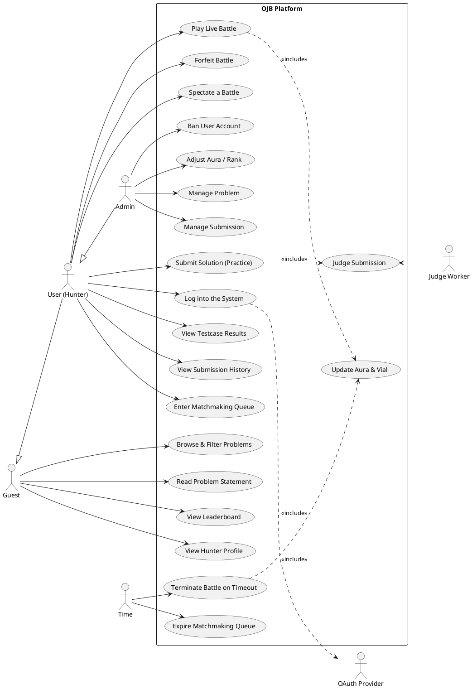
```plantuml
@startuml
left to right direction
skinparam packageStyle rectangle

actor Guest
actor "User (Hunter)" as User
actor Admin
actor "Judge Worker" as Judge
actor "OAuth Provider" as OAuth
actor Time

Guest <|-- User
User <|-- Admin

rectangle "OJB Platform" {
  usecase "Browse & Filter Problems" as UC1
  usecase "Read Problem Statement" as UC2
  usecase "View Leaderboard" as UC3
  usecase "View Hunter Profile" as UC4

  usecase "Log into the System" as UC5
  usecase "Submit Solution (Practice)" as UC6
  usecase "View Testcase Results" as UC7
  usecase "View Submission History" as UC8

  usecase "Enter Matchmaking Queue" as UC9
  usecase "Play Live Battle" as UC10
  usecase "Forfeit Battle" as UC11
  usecase "Spectate a Battle" as UC12

  usecase "Judge Submission" as UC13
  usecase "Update Aura & Vial" as UC14
  usecase "Terminate Battle on Timeout" as UC15
  usecase "Expire Matchmaking Queue" as UC16

  usecase "Manage Problem" as UC17
  usecase "Manage Submission" as UC18
  usecase "Ban User Account" as UC19
  usecase "Adjust Aura / Rank" as UC20
}

Guest --> UC1
Guest --> UC2
Guest --> UC3
Guest --> UC4

User --> UC5
User --> UC6
User --> UC7
User --> UC8
User --> UC9
User --> UC10
User --> UC11
User --> UC12

Admin --> UC17
Admin --> UC18
Admin --> UC19
Admin --> UC20

UC5 ..> OAuth : <<include>>
UC6 ..> UC13 : <<include>>
UC13 <-- Judge
UC10 ..> UC14 : <<include>>
Time --> UC15
Time --> UC16
UC15 ..> UC14 : <<include>>
@enduml
```

### 2.4.2 Module 1: Account & Hunter Identity

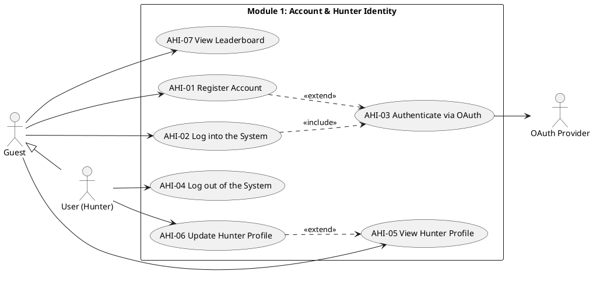
```plantuml
@startuml
left to right direction
actor Guest
actor "User (Hunter)" as User
actor "OAuth Provider" as OAuth
Guest <|-- User

rectangle "Module 1: Account & Hunter Identity" {
  usecase "AHI-01 Register Account" as A1
  usecase "AHI-02 Log into the System" as A2
  usecase "AHI-03 Authenticate via OAuth" as A3
  usecase "AHI-04 Log out of the System" as A4
  usecase "AHI-05 View Hunter Profile" as A5
  usecase "AHI-06 Update Hunter Profile" as A6
  usecase "AHI-07 View Leaderboard" as A7
}

Guest --> A1
Guest --> A2
Guest --> A5
Guest --> A7
User --> A4
User --> A6
A2 ..> A3 : <<include>>
A1 ..> A3 : <<extend>>
A6 ..> A5 : <<extend>>
A3 --> OAuth
@enduml
```

### 2.4.3 Module 2: Practice & Submission

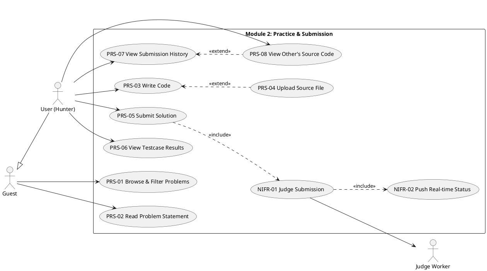
```plantuml
@startuml
left to right direction
actor Guest
actor "User (Hunter)" as User
actor "Judge Worker" as Judge
Guest <|-- User

rectangle "Module 2: Practice & Submission" {
  usecase "PRS-01 Browse & Filter Problems" as P1
  usecase "PRS-02 Read Problem Statement" as P2
  usecase "PRS-03 Write Code" as P3
  usecase "PRS-04 Upload Source File" as P4
  usecase "PRS-05 Submit Solution" as P5
  usecase "PRS-06 View Testcase Results" as P6
  usecase "PRS-07 View Submission History" as P7
  usecase "PRS-08 View Other's Source Code" as P8
  usecase "NIFR-01 Judge Submission" as N1
  usecase "NIFR-02 Push Real-time Status" as N2
}

Guest --> P1
Guest --> P2
User --> P3
User --> P5
User --> P6
User --> P7
User --> P8

P3 <.. P4 : <<extend>>
P5 ..> N1 : <<include>>
N1 ..> N2 : <<include>>
P7 <.. P8 : <<extend>>
N1 --> Judge
@enduml
```

### 2.4.4 Module 3: Live Battle, Aura & Rank

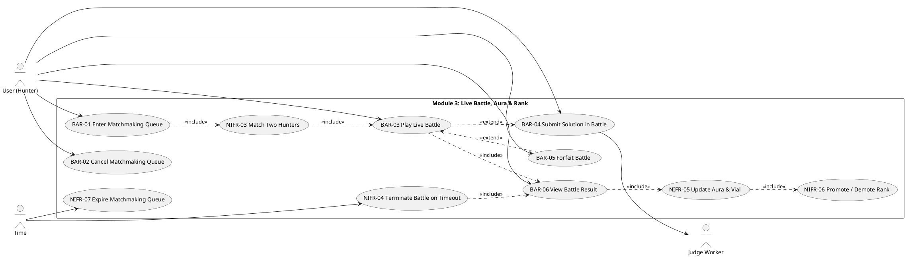
```plantuml
@startuml
left to right direction
actor "User (Hunter)" as User
actor "Judge Worker" as Judge
actor Time

rectangle "Module 3: Live Battle, Aura & Rank" {
  usecase "BAR-01 Enter Matchmaking Queue" as B1
  usecase "BAR-02 Cancel Matchmaking Queue" as B2
  usecase "BAR-03 Play Live Battle" as B3
  usecase "BAR-04 Submit Solution in Battle" as B4
  usecase "BAR-05 Forfeit Battle" as B5
  usecase "BAR-06 View Battle Result" as B6
  usecase "NIFR-03 Match Two Hunters" as N3
  usecase "NIFR-04 Terminate Battle on Timeout" as N4
  usecase "NIFR-05 Update Aura & Vial" as N5
  usecase "NIFR-06 Promote / Demote Rank" as N6
  usecase "NIFR-07 Expire Matchmaking Queue" as N7
}

User --> B1
User --> B2
User --> B3
User --> B4
User --> B5
User --> B6

B1 ..> N3 : <<include>>
N3 ..> B3 : <<include>>
B3 ..> B4 : <<extend>>
B3 <.. B5 : <<extend>>
B4 --> Judge
B3 ..> B6 : <<include>>
B6 ..> N5 : <<include>>
N5 ..> N6 : <<include>>
Time --> N4
Time --> N7
N4 ..> B6 : <<include>>
@enduml
```

### 2.4.5 Module 4: Spectate & Administration

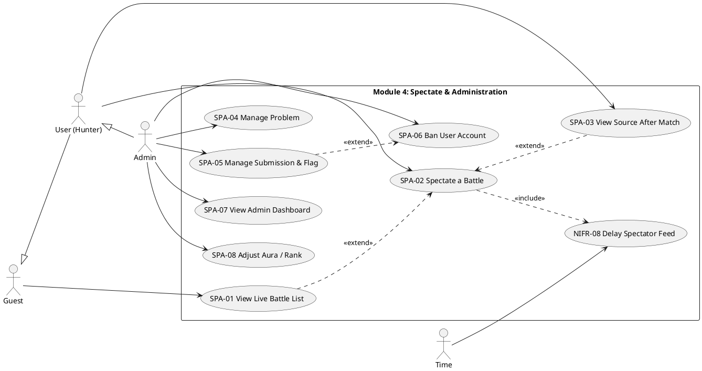
```plantuml
@startuml
left to right direction
actor Guest
actor "User (Hunter)" as User
actor Admin
actor Time
Guest <|-- User
User <|-- Admin

rectangle "Module 4: Spectate & Administration" {
  usecase "SPA-01 View Live Battle List" as S1
  usecase "SPA-02 Spectate a Battle" as S2
  usecase "SPA-03 View Source After Match" as S3
  usecase "SPA-04 Manage Problem" as S4
  usecase "SPA-05 Manage Submission & Flag" as S5
  usecase "SPA-06 Ban User Account" as S6
  usecase "SPA-07 View Admin Dashboard" as S7
  usecase "SPA-08 Adjust Aura / Rank" as S8
  usecase "NIFR-08 Delay Spectator Feed" as N8
}

Guest --> S1
User --> S2
User --> S3
Admin --> S4
Admin --> S5
Admin --> S6
Admin --> S7
Admin --> S8

S1 ..> S2 : <<extend>>
S2 ..> N8 : <<include>>
S2 <.. S3 : <<extend>>
S5 ..> S6 : <<extend>>
Time --> N8
@enduml
```

---

## 2.5 Use-Case Scenarios

### 2.5.1 Module 1: Account & Hunter Identity

#### AHI-01: Register Account

| Field | Content |
|---|---|
| **Use-Case ID** | AHI-01 |
| **Use-Case Name** | Register Account |
| **Description** | Cho phép khách truy cập tạo một tài khoản Hunter mới trên OJB. |
| **Actor(s)** | Guest |
| **Priority** | High |
| **Trigger** | Guest nhấn nút "Đăng ký". |
| **Pre-Condition(s)** | Guest chưa đăng nhập và chưa có tài khoản với email này. |
| **Post-Condition(s)** | Tài khoản mới được tạo với hạng *Chưa Thức Tỉnh*, Aura = 0; Hunter Card khởi tạo. |
| **Basic Flow** | 1. Guest mở form đăng ký. 2. Guest nhập email, mật khẩu, tên hiển thị. 3. System kiểm tra email chưa tồn tại và mật khẩu đủ mạnh. 4. System hash mật khẩu và tạo bản ghi User (aura = 0, rank = Unawakened). 5. System tạo phiên đăng nhập và chuyển Guest tới Dashboard. |
| **Alternative Flow** | 2a. Guest chọn "Đăng ký bằng Google/GitHub". 2a1. System gọi use case *Authenticate via OAuth Provider (AHI-03)*. 2a2. System tạo tài khoản từ thông tin trả về. Luồng tiếp tục ở bước 5. |
| **Exception Flow** | 3a. Email đã tồn tại. 3a1. System hiển thị "Email đã được sử dụng" và gợi ý đăng nhập. Luồng quay lại bước 2. 3b. Mật khẩu không đạt yêu cầu. 3b1. System hiển thị tiêu chí mật khẩu. Luồng quay lại bước 2. |

#### AHI-02: Log into the System

| Field | Content |
|---|---|
| **Use-Case ID** | AHI-02 |
| **Use-Case Name** | Log into the System |
| **Description** | Cho phép người dùng đăng nhập và nhận JWT để truy cập chức năng theo phân quyền. |
| **Actor(s)** | Guest, OAuth Provider |
| **Priority** | High |
| **Trigger** | Người dùng chưa xác thực nhấn "Đăng nhập". |
| **Pre-Condition(s)** | Người dùng đã có tài khoản hợp lệ và không bị ban. |
| **Post-Condition(s)** | Một phiên xác thực (JWT) được cấp; người dùng vào Dashboard với Hunter Card của mình. |
| **Basic Flow** | 1. User nhập email + mật khẩu và nhấn "Đăng nhập". 2. System xác thực thông tin đăng nhập. 3. System kiểm tra trạng thái ban của tài khoản. 4. System cấp JWT kèm role (USER/ADMIN). 5. System hiển thị Dashboard kèm Hunter Card (rank, Aura, % phễu). |
| **Alternative Flow** | 1a. User chọn đăng nhập bằng OAuth. 1a1. System include use case *AHI-03 Authenticate via OAuth Provider*. 1a2. Khi AHI-03 thành công, luồng tiếp tục ở bước 3. |
| **Exception Flow** | 2a. Thông tin đăng nhập sai. 2a1. System hiển thị "Email hoặc mật khẩu không đúng". Luồng quay lại bước 1. 2a2. Sau 5 lần sai liên tiếp, System khóa đăng nhập 5 phút. Use case kết thúc. 3a. Tài khoản đang bị ban. 3a1. System hiển thị lý do ban và thời hạn. Use case kết thúc thất bại. |

#### AHI-03: Authenticate via OAuth Provider

| Field | Content |
|---|---|
| **Use-Case ID** | AHI-03 |
| **Use-Case Name** | Authenticate via OAuth Provider |
| **Description** | Use case kỹ thuật mô tả tương tác với nhà cung cấp OAuth2 bên ngoài để xác minh danh tính người dùng. |
| **Actor(s)** | OAuth Provider |
| **Priority** | Medium |
| **Trigger** | Use case AHI-01 hoặc AHI-02 include use case này. |
| **Pre-Condition(s)** | Hệ thống đã cấu hình đúng client ID/secret và redirect URI của provider. |
| **Post-Condition(s)** | **Success:** Token định danh hợp lệ được trả về cho use case gọi. **Failure:** Trả về chỉ báo xác thực thất bại. |
| **Basic Flow** | 1. System redirect trình duyệt của User sang trang đăng nhập của OAuth Provider. 2. User nhập thông tin và cấp quyền cho OJB. 3. OAuth Provider xác minh và redirect về OJB kèm authorization code. 4. System đổi code lấy access token và lấy thông tin định danh (email, tên, avatar). 5. System xác thực token và trả kết quả cho use case gọi. |
| **Alternative Flow** | None. |
| **Exception Flow** | 2a. User từ chối cấp quyền. 2a1. Provider redirect về kèm lỗi `access_denied`; System hiển thị "Đăng nhập bị hủy". Use case kết thúc. 4a. Đổi code lấy token thất bại hoặc provider không phản hồi. 4a1. System hiển thị "Không kết nối được tới nhà cung cấp đăng nhập. Vui lòng thử lại." Use case kết thúc thất bại. |

#### AHI-04: Log out of the System

| Field | Content |
|---|---|
| **Use-Case ID** | AHI-04 |
| **Use-Case Name** | Log out of the System |
| **Description** | Cho phép người dùng chủ động kết thúc phiên làm việc hiện tại. |
| **Actor(s)** | User (Hunter) |
| **Priority** | Medium |
| **Trigger** | User nhấn "Đăng xuất". |
| **Pre-Condition(s)** | User đang đăng nhập. |
| **Post-Condition(s)** | Token bị thu hồi; các route được bảo vệ không còn truy cập được. |
| **Basic Flow** | 1. User nhấn "Đăng xuất". 2. System yêu cầu backend thu hồi refresh token. 3. System xóa token phía client. 4. System chuyển hướng User về trang chủ công khai. |
| **Alternative Flow** | 1a. User đang trong một trận battle ACTIVE. 1a1. System cảnh báo "Đăng xuất lúc này sẽ bị tính là bỏ cuộc". 1a2. Nếu User xác nhận, System gọi use case *BAR-05 Forfeit Battle* rồi tiếp tục ở bước 2. 1a3. Nếu User hủy, use case kết thúc. |
| **Exception Flow** | 2a. Backend không phản hồi. 2a1. System vẫn xóa token phía client và cảnh báo "Phiên đã đóng cục bộ". Use case kết thúc. |

#### AHI-05: View Hunter Profile

| Field | Content |
|---|---|
| **Use-Case ID** | AHI-05 |
| **Use-Case Name** | View Hunter Profile |
| **Description** | Cho phép xem hồ sơ công khai của một Hunter: hạng, glow, phễu Aura, chứng chỉ, biểu đồ Aura, thống kê. |
| **Actor(s)** | Guest, User (Hunter) |
| **Priority** | High |
| **Trigger** | Người dùng nhấn vào tên/avatar của một Hunter, hoặc chọn "Hồ sơ của tôi". |
| **Pre-Condition(s)** | Hunter được xem tồn tại và không bị xóa. |
| **Post-Condition(s)** | Thông tin hồ sơ được hiển thị. |
| **Basic Flow** | 1. Người dùng mở trang profile của một Hunter. 2. System truy vấn thông tin User: aura, rank, vialFillPercent, peakAura, wins/losses. 3. System truy vấn AuraHistory để dựng biểu đồ Aura theo thời gian. 4. System tính topic mạnh/yếu từ lịch sử submission. 5. System hiển thị profile kèm phễu Aura trực quan, badge glow theo hạng và chứng chỉ thợ săn. |
| **Alternative Flow** | 1a. Người xem chính là chủ tài khoản. 1a1. System hiển thị thêm nút "Chỉnh sửa hồ sơ" và tab lịch sử submission cá nhân. |
| **Exception Flow** | 2a. Hunter không tồn tại. 2a1. System hiển thị trang 404 "Không tìm thấy thợ săn". Use case kết thúc. 3a. Không truy vấn được AuraHistory. 3a1. System vẫn hiển thị profile nhưng thay biểu đồ bằng thông báo "Chưa có dữ liệu". Luồng tiếp tục ở bước 4. |

#### AHI-06: Update Hunter Profile

| Field | Content |
|---|---|
| **Use-Case ID** | AHI-06 |
| **Use-Case Name** | Update Hunter Profile |
| **Description** | Cho phép Hunter chỉnh sửa các trường không cốt lõi trong hồ sơ của chính mình. |
| **Actor(s)** | User (Hunter) |
| **Priority** | Medium |
| **Trigger** | User đang xem hồ sơ của mình và nhấn "Chỉnh sửa hồ sơ". |
| **Pre-Condition(s)** | User đã đăng nhập và đang xem profile của chính mình. |
| **Post-Condition(s)** | Thông tin hồ sơ được cập nhật và hiển thị ngay. |
| **Basic Flow** | 1. User nhấn "Chỉnh sửa hồ sơ". 2. System hiển thị các trường sửa được: tên hiển thị, avatar, bio. 3. User chỉnh sửa thông tin. 4. User nhấn "Lưu thay đổi". 5. System kiểm tra hợp lệ (tên không trùng, ảnh ≤ 2MB, định dạng ảnh hợp lệ). 6. System cập nhật CSDL và hiển thị hồ sơ mới kèm thông báo thành công. |
| **Alternative Flow** | 3a. User tải lên avatar mới. 3a1. System hiển thị preview ảnh trước khi lưu. Luồng tiếp tục ở bước 4. |
| **Exception Flow** | 5a. Dữ liệu không hợp lệ. 5a1. System đánh dấu trường lỗi kèm thông báo. Luồng quay lại bước 3. 5b. User cố sửa trường read-only (Aura, rank, win/loss) qua API. 5b1. System từ chối với mã 403 và ghi log. Use case kết thúc thất bại. |

#### AHI-07: View Leaderboard

| Field | Content |
|---|---|
| **Use-Case ID** | AHI-07 |
| **Use-Case Name** | View Leaderboard |
| **Description** | Cho phép người dùng xem bảng xếp hạng toàn hệ thống, lọc theo hạng. |
| **Actor(s)** | Guest, User (Hunter) |
| **Priority** | Medium |
| **Trigger** | Người dùng chọn "Bảng xếp hạng" trên thanh điều hướng. |
| **Pre-Condition(s)** | Không có. |
| **Post-Condition(s)** | Bảng xếp hạng được hiển thị theo thứ tự Aura giảm dần. |
| **Basic Flow** | 1. Người dùng mở trang Leaderboard. 2. System truy vấn danh sách Hunter sắp xếp theo Aura giảm dần (đồng Aura → win rate cao hơn xếp trước). 3. System hiển thị avatar kèm glow, tên, rank badge, Aura, % phễu, thắng/thua, win rate. 4. System đánh dấu vị trí của người dùng hiện tại (nếu đã đăng nhập). |
| **Alternative Flow** | 2a. Người dùng chọn lọc theo một hạng cụ thể (ví dụ S-Rank). 2a1. System chỉ hiển thị Hunter thuộc hạng đó. Luồng tiếp tục ở bước 3. |
| **Exception Flow** | 2a. Không có Hunter nào đạt điều kiện lọc. 2a1. System hiển thị "Chưa có thợ săn nào ở hạng này". Use case kết thúc. |

---

### 2.5.2 Module 2: Practice & Submission

#### PRS-01: Browse & Filter Problems

| Field | Content |
|---|---|
| **Use-Case ID** | PRS-01 |
| **Use-Case Name** | Browse & Filter Problems |
| **Description** | Cho phép người dùng duyệt danh sách bài tập và lọc theo topic, độ khó, ngôn ngữ, trạng thái cá nhân. |
| **Actor(s)** | Guest, User (Hunter) |
| **Priority** | High |
| **Trigger** | Người dùng mở trang Problems hoặc thay đổi bộ lọc. |
| **Pre-Condition(s)** | Có ít nhất một problem ở trạng thái Public. |
| **Post-Condition(s)** | Danh sách problem khớp bộ lọc được hiển thị. |
| **Basic Flow** | 1. Người dùng mở trang Problems. 2. System truy vấn các problem có status = Public (cursor-based paging). 3. System tính trạng thái cá nhân (Solved/Attempted/None) cho từng bài nếu người dùng đã đăng nhập. 4. System hiển thị bảng/card gồm tiêu đề, tag, độ khó, tỉ lệ AC, trạng thái. 5. Người dùng chọn bộ lọc (topic / độ khó / ngôn ngữ / trạng thái). 6. System áp bộ lọc và cập nhật danh sách. |
| **Alternative Flow** | 3a. Người dùng là Guest. 3a1. System bỏ qua cột trạng thái cá nhân. Luồng tiếp tục ở bước 4. 6a. Người dùng cuộn xuống cuối danh sách. 6a1. System nạp trang tiếp theo bằng cursor. |
| **Exception Flow** | 6a. Không có problem nào khớp bộ lọc. 6a1. System hiển thị "Không tìm thấy bài phù hợp" và gợi ý xóa bớt bộ lọc. Use case kết thúc. |

#### PRS-02: Read Problem Statement

| Field | Content |
|---|---|
| **Use-Case ID** | PRS-02 |
| **Use-Case Name** | Read Problem Statement |
| **Description** | Cho phép người dùng đọc đề bài trong không gian tối ưu cho việc đọc, không có code editor gây phân tâm. |
| **Actor(s)** | Guest, User (Hunter) |
| **Priority** | High |
| **Trigger** | Người dùng nhấn vào một problem trong danh sách. |
| **Pre-Condition(s)** | Problem tồn tại và có status = Public. |
| **Post-Condition(s)** | Đề bài được hiển thị đầy đủ; tab bar (Đề bài / Code / Test Cases) sẵn sàng. |
| **Basic Flow** | 1. Người dùng mở `/problems/{slug}`. 2. System truy vấn nội dung problem. 3. System render đề bài (Markdown + LaTeX), input/output format, ràng buộc, ví dụ mẫu, time/memory limit, tag. 4. System hiển thị tab bar cố định ở đầu vùng nội dung. 5. Người dùng đọc đề; có thể copy nhanh block ràng buộc/ví dụ. |
| **Alternative Flow** | 5a. Đề bài dài. 5a1. System hiển thị mục lục (TOC) để điều hướng nhanh trong đề. 5b. Người dùng nhấn "Bắt đầu làm → Code". 5b1. System chuyển sang `/problems/{slug}/code` bằng client-side routing (use case PRS-03). |
| **Exception Flow** | 2a. Problem không tồn tại hoặc chưa Public. 2a1. System hiển thị 404. Use case kết thúc. |

#### PRS-03: Write Code

| Field | Content |
|---|---|
| **Use-Case ID** | PRS-03 |
| **Use-Case Name** | Write Code |
| **Description** | Cho phép Hunter soạn thảo lời giải trên Monaco Editor và tự động lưu bản nháp theo `(problemId, language)`. |
| **Actor(s)** | User (Hunter) |
| **Priority** | High |
| **Trigger** | Hunter mở tab `💻 Code` của một problem. |
| **Pre-Condition(s)** | Hunter đã đăng nhập; problem tồn tại. |
| **Post-Condition(s)** | Bản nháp code được lưu tự động; sẵn sàng để nộp. |
| **Basic Flow** | 1. Hunter mở `/problems/{slug}/code`. 2. System nạp bản nháp gần nhất theo `(problemId, language)` từ local store nếu có. 3. System hiển thị Monaco Editor full-width với syntax highlight theo ngôn ngữ đang chọn. 4. Hunter gõ hoặc paste code. 5. System autosave bản nháp (debounce ~1s) vào client store + localStorage. |
| **Alternative Flow** | 3a. Hunter đổi ngôn ngữ trong dropdown. 3a1. System lưu bản nháp của ngôn ngữ cũ, nạp bản nháp của ngôn ngữ mới (nếu có) và đổi syntax highlight. 4a. Hunter chọn nạp code từ file → gọi use case *PRS-04 Upload Source File*. 5a. Hunter chuyển sang tab Đề bài hoặc Test Cases rồi quay lại. 5a1. System khôi phục nguyên vẹn code, ngôn ngữ và vị trí con trỏ. |
| **Exception Flow** | 5a. localStorage đầy hoặc bị chặn. 5a1. System cảnh báo "Không thể lưu nháp cục bộ" và chuyển sang lưu tạm trong bộ nhớ phiên. Luồng tiếp tục. |

#### PRS-04: Upload Source File

| Field | Content |
|---|---|
| **Use-Case ID** | PRS-04 |
| **Use-Case Name** | Upload Source File |
| **Description** | Cho phép Hunter nạp code từ file `.cpp`, `.java`, `.sql` vào editor thay vì gõ tay. |
| **Actor(s)** | User (Hunter) |
| **Priority** | Low |
| **Trigger** | Hunter nhấn nút "Upload" trên thanh công cụ editor. |
| **Pre-Condition(s)** | Hunter đang ở tab Code của một problem. |
| **Post-Condition(s)** | Nội dung file được nạp vào editor và trở thành bản nháp hiện tại. |
| **Basic Flow** | 1. Hunter nhấn "Upload" và chọn file từ máy. 2. System kiểm tra phần mở rộng hợp lệ (`.cpp`, `.java`, `.sql`). 3. System kiểm tra kích thước ≤ 64KB. 4. System đọc nội dung file và điền vào editor. 5. System tự động chọn ngôn ngữ tương ứng với phần mở rộng và autosave bản nháp. |
| **Alternative Flow** | 4a. Editor đang có code. 4a1. System hỏi xác nhận "Ghi đè code hiện tại?". Nếu Hunter đồng ý, luồng tiếp tục ở bước 4; nếu không, use case kết thúc. |
| **Exception Flow** | 2a. Phần mở rộng không hợp lệ. 2a1. System báo "Chỉ hỗ trợ .cpp, .java, .sql". Use case kết thúc. 3a. File vượt 64KB. 3a1. System báo "Kích thước tối đa 64KB". Use case kết thúc. |

#### PRS-05: Submit Solution (Practice)

| Field | Content |
|---|---|
| **Use-Case ID** | PRS-05 |
| **Use-Case Name** | Submit Solution (Practice) |
| **Description** | Cho phép Hunter nộp lời giải ngoài battle và theo dõi trạng thái chấm real-time ngay trên trang Code. |
| **Actor(s)** | User (Hunter) |
| **Priority** | High |
| **Trigger** | Hunter nhấn nút "Submit" ở tab Code. |
| **Pre-Condition(s)** | Hunter đã đăng nhập, editor có nội dung, chưa vượt rate limit. |
| **Post-Condition(s)** | Một Submission được tạo, chấm xong và lưu verdict; trạng thái cá nhân của bài được cập nhật. |
| **Basic Flow** | 1. Hunter nhấn "Submit". 2. System kiểm tra rate limit (≤ 5 lần/phút/problem) và kích thước source (≤ 64KB). 3. System tạo Submission với status = PENDING và trả `submissionId` ngay lập tức. 4. System đẩy job chấm vào hàng đợi → include use case *NIFR-01 Judge Submission*. 5. System đẩy cập nhật trạng thái real-time về client (`PENDING → COMPILING → JUDGING (x/n) → DONE`) qua *NIFR-02*. 6. System hiển thị verdict tổng (AC / PA xx% / WA / TLE / MLE / RE / CE / PE) gọn ngay dưới editor. 7. System hiển thị badge nhắc "Có kết quả chi tiết → xem Test Cases". |
| **Alternative Flow** | 6a. Verdict = AC. 6a1. System cập nhật trạng thái bài thành *Solved* và tăng `acCount` của problem. |
| **Exception Flow** | 2a. Vượt rate limit. 2a1. System từ chối và hiển thị thời gian chờ còn lại. Use case kết thúc. 2b. Source vượt 64KB. 2b1. System từ chối kèm thông báo. Use case kết thúc. 4a. Judge Worker crash giữa chừng. 4a1. Hàng đợi retry job; nếu vượt số lần retry, submission chuyển sang trạng thái `SYSTEM_ERROR` và System thông báo "Lỗi hệ thống, vui lòng nộp lại". Use case kết thúc. 5a. Client mất kết nối. 5a1. Khi kết nối lại, System đồng bộ trạng thái mới nhất của `submissionId`. Luồng tiếp tục ở bước 6. |

#### PRS-06: View Testcase Results

| Field | Content |
|---|---|
| **Use-Case ID** | PRS-06 |
| **Use-Case Name** | View Testcase Results |
| **Description** | Cho phép Hunter xem chi tiết kết quả từng testcase của một submission, có thể so sánh giữa các submission gần đây của cùng bài. |
| **Actor(s)** | User (Hunter) |
| **Priority** | High |
| **Trigger** | Hunter mở tab `🧪 Test Cases` của một problem. |
| **Pre-Condition(s)** | Hunter đã có ít nhất một submission cho bài này (để xem kết quả chấm). |
| **Post-Condition(s)** | Chi tiết từng testcase được hiển thị. |
| **Basic Flow** | 1. Hunter mở `/problems/{slug}/tests`. 2. System hiển thị danh sách sample testcase công khai (input, expected output, ghi chú). 3. System nạp kết quả chấm của submission gần nhất. 4. System hiển thị với sample case: input / expected / got + verdict + time + memory. 5. System hiển thị với private case: chỉ verdict + time + memory (không lộ dữ liệu test). 6. System hiển thị thanh tổng hợp: `AC 7/10 (70%) · max 38ms · 12MB`. |
| **Alternative Flow** | 3a. Hunter chọn một submission khác từ dropdown lịch sử của bài này. 3a1. System nạp và hiển thị kết quả của submission đó. Luồng tiếp tục ở bước 4. 2a. Hunter nhấn nút copy trên một sample input. 2a1. System sao chép input vào clipboard. |
| **Exception Flow** | 3a. Hunter chưa có submission nào cho bài này. 3a1. System chỉ hiển thị sample testcase kèm thông báo "Chưa có kết quả chấm — hãy nộp bài trước". Use case kết thúc. |

#### PRS-07: View Submission History

| Field | Content |
|---|---|
| **Use-Case ID** | PRS-07 |
| **Use-Case Name** | View Submission History |
| **Description** | Cho phép người dùng xem bảng lịch sử submission toàn hệ thống hoặc lịch sử cá nhân, có bộ lọc. |
| **Actor(s)** | User (Hunter) |
| **Priority** | Medium |
| **Trigger** | Người dùng mở trang "Submissions" hoặc tab lịch sử trong Profile. |
| **Pre-Condition(s)** | Người dùng đã đăng nhập. |
| **Post-Condition(s)** | Danh sách submission được hiển thị theo bộ lọc. |
| **Basic Flow** | 1. Hunter mở trang Submissions. 2. System truy vấn danh sách submission (user, problem, ngôn ngữ, verdict, thời gian chạy, thời điểm nộp). 3. Hunter áp bộ lọc theo verdict / ngôn ngữ / problem / user. 4. System cập nhật danh sách theo bộ lọc. 5. Hunter nhấn vào một dòng để xem chi tiết → gọi use case *PRS-08* nếu là submission của người khác. |
| **Alternative Flow** | 1a. Hunter mở tab lịch sử trong Profile của chính mình. 1a1. System chỉ hiển thị submission của Hunter đó; Hunter xem được source của mọi submission của chính mình. |
| **Exception Flow** | 4a. Không có submission khớp bộ lọc. 4a1. System hiển thị "Không có kết quả". Use case kết thúc. |

#### PRS-08: View Other User's Source Code

| Field | Content |
|---|---|
| **Use-Case ID** | PRS-08 |
| **Use-Case Name** | View Other User's Source Code |
| **Description** | Cho phép Hunter xem source code của submission người khác, với điều kiện Hunter đã AC bài đó (cơ chế ẩn solution). |
| **Actor(s)** | User (Hunter) |
| **Priority** | Medium |
| **Trigger** | Hunter nhấn vào một submission của người khác trong bảng lịch sử. |
| **Pre-Condition(s)** | Hunter đã đăng nhập; submission tồn tại. |
| **Post-Condition(s)** | Source code được hiển thị **nếu và chỉ nếu** Hunter đã AC bài đó. |
| **Basic Flow** | 1. Hunter nhấn vào một submission của người khác. 2. System hiển thị metadata công khai: verdict, time, memory, ngôn ngữ, thời điểm nộp. 3. System kiểm tra Hunter đã có submission AC cho problem này chưa. 4. Điều kiện thỏa mãn → System hiển thị source code của submission. |
| **Alternative Flow** | 3a. Submission thuộc về chính Hunter. 3a1. System hiển thị source ngay, bỏ qua kiểm tra AC. |
| **Exception Flow** | 3a. Hunter chưa AC bài này. 3a1. System ẩn source và hiển thị "Bạn cần AC bài này trước khi xem lời giải của người khác". Metadata vẫn hiển thị. Use case kết thúc. 3b. Hunter cố truy cập source qua API trực tiếp. 3b1. System trả 403 và ghi log. Use case kết thúc thất bại. |

---

### 2.5.3 Module 3: Live Battle, Aura & Rank

#### BAR-01: Enter Matchmaking Queue

| Field | Content |
|---|---|
| **Use-Case ID** | BAR-01 |
| **Use-Case Name** | Enter Matchmaking Queue |
| **Description** | Cho phép Hunter chọn topic + độ khó và vào hàng đợi ghép trận tự động. |
| **Actor(s)** | User (Hunter) |
| **Priority** | High |
| **Trigger** | Hunter nhấn "Tìm trận" (Find Battle). |
| **Pre-Condition(s)** | Hunter đã đăng nhập, không bị ban, và không đang trong một trận ACTIVE nào khác. |
| **Post-Condition(s)** | Hunter được đưa vào hàng đợi matchmaking, hoặc được ghép trận thành công. |
| **Basic Flow** | 1. Hunter chọn topic và độ khó (Easy / Medium / Hard). 2. Hunter nhấn "Tìm trận". 3. System đưa Hunter vào hàng đợi kèm Aura hiện tại, topic, difficulty. 4. System hiển thị màn hình chờ có bộ đếm thời gian và nút "Hủy". 5. System gọi use case *NIFR-03 Match Two Hunters* để tìm đối thủ. 6. Ghép thành công → System chuyển cả hai vào trận (use case *BAR-03*). |
| **Alternative Flow** | 5a. Sau 60s chưa tìm được đối thủ. 5a1. System tự nới ngưỡng Aura từ ±200 lên ±400 mà không cần Hunter thao tác lại. Luồng tiếp tục ở bước 5. 4a. Hunter nhấn "Hủy" → gọi use case *BAR-02*. |
| **Exception Flow** | 5a. Quá 3 phút vẫn không ghép được → gọi *NIFR-07 Expire Matchmaking Queue*; System báo "Không tìm được đối thủ". Use case kết thúc. 6a. Không còn problem phù hợp mà cả hai đều chưa solve. 6a1. System hủy match và thông báo cho cả hai "Không còn bài phù hợp". Cả hai được đưa trở lại hàng đợi hoặc thoát. Use case kết thúc. 3a. Hunter đang có một trận ACTIVE. 3a1. System từ chối và điều hướng Hunter về trận đang dở. Use case kết thúc. |

#### BAR-02: Cancel Matchmaking Queue

| Field | Content |
|---|---|
| **Use-Case ID** | BAR-02 |
| **Use-Case Name** | Cancel Matchmaking Queue |
| **Description** | Cho phép Hunter chủ động rời hàng đợi ghép trận trước khi được ghép. |
| **Actor(s)** | User (Hunter) |
| **Priority** | Medium |
| **Trigger** | Hunter nhấn "Hủy" trên màn hình chờ ghép trận. |
| **Pre-Condition(s)** | Hunter đang ở trong hàng đợi matchmaking. |
| **Post-Condition(s)** | Hunter được gỡ khỏi hàng đợi; không có trận nào được tạo. |
| **Basic Flow** | 1. Hunter nhấn "Hủy". 2. System gỡ Hunter khỏi hàng đợi. 3. System đóng màn hình chờ và đưa Hunter về Dashboard. |
| **Alternative Flow** | None. |
| **Exception Flow** | 2a. Hunter đã vừa được ghép trận ngay trước khi thao tác hủy tới nơi. 2a1. System bỏ qua yêu cầu hủy, thông báo "Đã tìm được đối thủ!" và đưa Hunter vào trận. Use case kết thúc. |

#### BAR-03: Play Live Battle

| Field | Content |
|---|---|
| **Use-Case ID** | BAR-03 |
| **Use-Case Name** | Play Live Battle |
| **Description** | Use case cốt lõi: hai Hunter cùng giải một bài trên một trang duy nhất, thấy tiến độ của nhau real-time, dưới áp lực đồng hồ đếm ngược. |
| **Actor(s)** | User (Hunter) × 2, Time |
| **Priority** | High |
| **Trigger** | Matchmaking ghép thành công (NIFR-03 hoàn tất). |
| **Pre-Condition(s)** | Hai Hunter đã được ghép; một problem hợp lệ đã được chọn từ pool. |
| **Post-Condition(s)** | Trận chuyển sang trạng thái DONE; Battle Score của hai bên được tính; Aura được cập nhật. |
| **Basic Flow** | 1. System khởi tạo Battle (status = ACTIVE) và đặt thời gian theo độ khó (Easy 15' / Medium 20' / Hard 30'). 2. System render giao diện một trang: header (avatar + glow 2 bên, đồng hồ), panel trái (đề bài), panel phải (Monaco Editor), bottom panel (Terminal / Test Cases), thanh tiến độ đối thủ. 3. Hunter đọc đề và viết code trong editor. 4. Hunter nộp bài nhiều lần → gọi use case *BAR-04 Submit Solution in Battle*. 5. System đẩy %AC cao nhất của mỗi bên sang đối phương real-time qua WebSocket (không lộ code, không lộ chi tiết testcase). 6. Trận kết thúc khi một bên đạt 100% AC hoặc Time actor báo hết giờ (*NIFR-04*). 7. System gọi use case *BAR-06 View Battle Result*. |
| **Alternative Flow** | 3a. Hunter kéo giãn split giữa Problem ↔ Editor. 3a1. System lưu tỉ lệ panel trong phiên, không đổi route. 3b. Hunter chuyển bottom panel giữa `Terminal` và `Test Cases`. 3b1. System toggle in-place, không reload, không đổi route. 4a. Hunter chọn bỏ cuộc → gọi use case *BAR-05 Forfeit Battle*. |
| **Exception Flow** | 5a. Hunter mất kết nối. 5a1. System giữ battle state trong Redis; nếu Hunter reconnect trong 30s, trận tiếp tục với đồng hồ vẫn chạy. 5a2. Nếu quá 30s không reconnect, System xử như bỏ cuộc (gọi *BAR-05*). Use case kết thúc. 2a. Không render được đề bài do lỗi Problem Service. 2a1. System hủy trận, không tính Aura cho cả hai, thông báo lỗi hệ thống. Use case kết thúc. |

#### BAR-04: Submit Solution in Battle

| Field | Content |
|---|---|
| **Use-Case ID** | BAR-04 |
| **Use-Case Name** | Submit Solution in Battle |
| **Description** | Cho phép Hunter nộp bài không giới hạn số lần trong trận, xem kết quả inline trên Terminal mà không rời trang. |
| **Actor(s)** | User (Hunter), Judge Worker |
| **Priority** | High |
| **Trigger** | Hunter nhấn "Submit" trong giao diện Battle. |
| **Pre-Condition(s)** | Trận đang ở trạng thái ACTIVE và đồng hồ chưa về 0. |
| **Post-Condition(s)** | Một BattleSubmission được ghi nhận kèm `acPercent` và `submittedAt`; %AC cao nhất được cập nhật cho cả hai bên. |
| **Basic Flow** | 1. Hunter nhấn "Submit" trong Battle. 2. System tạo Submission gắn `battleId` (bỏ qua rate limit thường). 3. System đẩy job chấm vào hàng đợi → *NIFR-01 Judge Submission*. 4. System ghi log lên panel Terminal: `[hh:mm] Submitting... C++`. 5. Judge trả verdict; System ghi tiếp lên Terminal, ví dụ `[hh:mm] PA — 7/10 testcases passed (70%)`. 6. System cập nhật tab Test Cases với chi tiết từng case của lần nộp này. 7. System ghi BattleSubmission và cập nhật %AC cao nhất của Hunter. 8. System đẩy %AC cao nhất mới sang đối thủ (chỉ con số, không kèm code). |
| **Alternative Flow** | 5a. Verdict = AC (100%). 5a1. System kết thúc trận ngay lập tức và chuyển sang *BAR-06 View Battle Result*. 2a. Hunter nộp liên tiếp nhiều lần. 2a1. System chấp nhận tất cả (không rate limit trong battle); Battle Score chỉ tính lần đạt %AC cao nhất sớm nhất. |
| **Exception Flow** | 5a. Verdict = CE (Compilation Error). 5a1. System ghi lỗi biên dịch lên Terminal (`CE — Line 5: expected ';'`); trận tiếp tục, không tính là kết thúc. Luồng quay lại bước 1. 3a. Judge Worker không phản hồi trong ngưỡng timeout. 3a1. System retry job; nếu thất bại, ghi lên Terminal "Lỗi hệ thống — lần nộp này không được tính" và không cập nhật %AC. Luồng quay lại bước 1. 1a. Hết giờ đúng lúc Hunter đang nộp. 1a1. Submission gửi sau thời điểm hết giờ bị từ chối và không tính điểm. Use case kết thúc. |

#### BAR-05: Forfeit Battle

| Field | Content |
|---|---|
| **Use-Case ID** | BAR-05 |
| **Use-Case Name** | Forfeit Battle |
| **Description** | Cho phép Hunter đầu hàng giữa trận; bị xử thua ngay và trừ Aura như thua thường. |
| **Actor(s)** | User (Hunter) |
| **Priority** | Medium |
| **Trigger** | Hunter nhấn "Bỏ cuộc" (Surrender), hoặc disconnect quá 30s. |
| **Pre-Condition(s)** | Trận đang ở trạng thái ACTIVE. |
| **Post-Condition(s)** | Hunter bỏ cuộc bị xử thua; đối thủ thắng; Aura hai bên được cập nhật. |
| **Basic Flow** | 1. Hunter nhấn "Bỏ cuộc". 2. System hiển thị hộp thoại xác nhận kèm cảnh báo bị trừ Aura. 3. Hunter xác nhận. 4. System đặt trận sang DONE, gán `winnerId` cho đối thủ. 5. System tính Aura delta theo công thức thua thường và gọi *NIFR-05 Update Aura & Aura Vial*. 6. System hiển thị overlay kết quả cho cả hai bên (use case *BAR-06*). |
| **Alternative Flow** | 1a. Hunter disconnect và không reconnect trong 30s. 1a1. System tự động kích hoạt forfeit thay cho Hunter, bỏ qua bước 2–3. Luồng tiếp tục ở bước 4. |
| **Exception Flow** | 3a. Hunter hủy hộp thoại xác nhận. 3a1. Trận tiếp tục bình thường. Use case kết thúc. 4a. Trận đã kết thúc trước đó (đối thủ vừa AC 100%). 4a1. System bỏ qua yêu cầu forfeit và hiển thị kết quả trận đã có. Use case kết thúc. |

#### BAR-06: View Battle Result

| Field | Content |
|---|---|
| **Use-Case ID** | BAR-06 |
| **Use-Case Name** | View Battle Result |
| **Description** | Hiển thị overlay kết quả trận ngay trên trang battle: so sánh Battle Score, Aura nhận/mất, animation rót Aura vào phễu và (nếu đủ) hiệu ứng thăng hạng. |
| **Actor(s)** | User (Hunter) × 2 |
| **Priority** | High |
| **Trigger** | Trận chuyển sang trạng thái DONE (một bên AC 100%, hết giờ, hoặc forfeit). |
| **Pre-Condition(s)** | Trận đã kết thúc và Battle Score của hai bên đã được tính. |
| **Post-Condition(s)** | Aura, rank, phễu và chứng chỉ của cả hai được cập nhật; kết quả hiển thị cho cả hai. |
| **Basic Flow** | 1. System tính `Battle Score = (%AC_best / 100) × TimeBonus` cho mỗi bên. 2. System xác định thắng/thua/hòa theo điểm; nếu bằng %AC thì ai đạt sớm hơn thắng. 3. System gọi use case *NIFR-05 Update Aura & Aura Vial*. 4. System gọi use case *NIFR-06 Promote / Demote Rank & Issue Certificate* nếu vượt trần/dưới sàn phễu. 5. System hiển thị overlay (ngay trên trang, không đổi route): Battle Score hai bên, Aura nhận/mất, animation rót Aura vào phễu. 6. Hunter đóng overlay và quay về Dashboard; Hunter Card đã cập nhật. |
| **Alternative Flow** | 4a. Phễu Aura đầy sau khi rót. 4a1. System phát animation thăng hạng, nâng cấp glow và trao Chứng chỉ Thợ Săn mới. 2a. Hai bên bằng Battle Score và bằng thời điểm đạt %AC (cực hiếm). 2a1. System xử hòa; `Actual = 0.5` cho cả hai khi tính Aura delta. |
| **Exception Flow** | 3a. Một trong hai Hunter đang bị ban tại thời điểm trận diễn ra. 3a1. System vẫn hiển thị kết quả nhưng đánh dấu bản ghi AuraHistory là vô hiệu; Aura không được cộng/trừ thực tế. Luồng tiếp tục ở bước 5. 5a. Hunter đã rời trang trước khi overlay hiện. 5a1. Kết quả vẫn được lưu; Hunter xem lại được trong lịch sử trận đấu ở Profile. Use case kết thúc. |

---

### 2.5.4 Module 4: Spectate & Administration

#### SPA-01: View Live Battle List

| Field | Content |
|---|---|
| **Use-Case ID** | SPA-01 |
| **Use-Case Name** | View Live Battle List |
| **Description** | Cho phép người dùng xem danh sách các trận đấu đang diễn ra để chọn trận muốn theo dõi. |
| **Actor(s)** | Guest, User (Hunter) |
| **Priority** | Medium |
| **Trigger** | Người dùng mở trang "Live Battles". |
| **Pre-Condition(s)** | Không có. |
| **Post-Condition(s)** | Danh sách trận ACTIVE được hiển thị và cập nhật real-time. |
| **Basic Flow** | 1. Người dùng mở trang Live Battles. 2. System truy vấn các Battle có status = ACTIVE. 3. System hiển thị: tên 2 người chơi (kèm rank badge + glow), topic, độ khó, thời gian còn lại, số spectator hiện tại. 4. System đăng ký kênh real-time để cập nhật danh sách khi có trận mới bắt đầu/kết thúc. 5. Người dùng nhấn vào một trận → gọi use case *SPA-02 Spectate a Battle*. |
| **Alternative Flow** | 2a. Người dùng lọc theo độ khó hoặc topic. 2a1. System chỉ hiển thị các trận khớp bộ lọc. Luồng tiếp tục ở bước 3. |
| **Exception Flow** | 2a. Không có trận nào đang diễn ra. 2a1. System hiển thị "Hiện chưa có trận nào. Hãy là người khai chiến!" kèm nút "Tìm trận". Use case kết thúc. |

#### SPA-02: Spectate a Battle

| Field | Content |
|---|---|
| **Use-Case ID** | SPA-02 |
| **Use-Case Name** | Spectate a Battle |
| **Description** | Cho phép người dùng theo dõi trực tiếp một trận đấu ở chế độ read-only, với luồng dữ liệu bị delay 5 giây để chống mách nước. |
| **Actor(s)** | User (Hunter), Time |
| **Priority** | Medium |
| **Trigger** | Người dùng nhấn vào một trận trong danh sách Live Battles. |
| **Pre-Condition(s)** | Trận đang ở trạng thái ACTIVE. |
| **Post-Condition(s)** | Người dùng theo dõi được diễn biến trận; số spectator của trận tăng thêm 1. |
| **Basic Flow** | 1. Người dùng nhấn vào một trận đang diễn ra. 2. System tăng bộ đếm spectator của trận và đăng ký người dùng vào kênh spectate. 3. System hiển thị layout giống Battle nhưng read-only: đề bài, terminal live của cả hai bên, %AC hai bên, đồng hồ đếm ngược. 4. System đẩy các sự kiện verdict qua use case *NIFR-08 Delay Spectator Feed* (trễ 5 giây). 5. Người dùng theo dõi tới khi trận kết thúc hoặc rời trang. 6. Khi rời, System giảm bộ đếm spectator. |
| **Alternative Flow** | 5a. Trận kết thúc trong lúc đang xem. 5a1. System hiển thị overlay kết quả (read-only) và mở tùy chọn xem code nếu người chơi cho phép → gọi *SPA-03*. |
| **Exception Flow** | 3a. Spectator cố gọi API submit/forfeit của trận. 3a1. System trả 403 "Spectator không có quyền thao tác" và ghi log. Use case tiếp tục ở chế độ xem. 1a. Trận vừa kết thúc ngay trước khi spectator vào. 1a1. System thông báo "Trận đã kết thúc" và chuyển sang trang kết quả trận. Use case kết thúc. |

#### SPA-03: View Battle Source Code After Match

| Field | Content |
|---|---|
| **Use-Case ID** | SPA-03 |
| **Use-Case Name** | View Battle Source Code After Match |
| **Description** | Cho phép spectator xem source code của người chơi sau khi trận kết thúc, nếu người chơi đó cho phép. |
| **Actor(s)** | User (Hunter) |
| **Priority** | Low |
| **Trigger** | Trận kết thúc và spectator nhấn "Xem code". |
| **Pre-Condition(s)** | Trận có status = DONE; người chơi đã bật tùy chọn công khai code. |
| **Post-Condition(s)** | Source code của người chơi được hiển thị cho spectator. |
| **Basic Flow** | 1. Trận kết thúc; System hiển thị overlay kết quả cho spectator. 2. Spectator nhấn "Xem code" của một người chơi. 3. System kiểm tra cờ cho phép công khai code của người chơi đó. 4. Điều kiện thỏa mãn → System hiển thị source code của các submission trong trận. |
| **Alternative Flow** | 2a. Cả hai người chơi đều cho phép. 2a1. System hiển thị chế độ so sánh song song hai lời giải. |
| **Exception Flow** | 3a. Người chơi không cho phép công khai code. 3a1. System hiển thị "Người chơi này chưa công khai lời giải". Use case kết thúc. 1a. Trận vẫn đang ACTIVE. 1a1. System không hiển thị nút "Xem code"; mọi truy cập API trả 403. Use case kết thúc. |

#### SPA-04: Manage Problem

| Field | Content |
|---|---|
| **Use-Case ID** | SPA-04 |
| **Use-Case Name** | Manage Problem |
| **Description** | Cho phép Admin tạo, sửa, xóa problem cùng testcase, preview trước khi public và quản lý trạng thái Draft/Review/Public. |
| **Actor(s)** | Admin |
| **Priority** | High |
| **Trigger** | Admin mở trang "Quản lý Problem" và chọn tạo mới hoặc chỉnh sửa. |
| **Pre-Condition(s)** | Admin đã đăng nhập với role ADMIN. |
| **Post-Condition(s)** | Problem được lưu ở trạng thái tương ứng; nếu Public thì xuất hiện với User và vào pool battle. |
| **Basic Flow** | 1. Admin nhấn "Tạo problem mới". 2. Admin nhập tiêu đề, đề bài (Markdown + LaTeX), input/output format, ràng buộc, time/memory limit, difficulty, tag. 3. Admin thêm testcase: upload file hoặc nhập tay, đánh dấu sample/private, gán điểm. 4. Admin nhấn "Preview" để xem đề render đúng như trang đề bài thật. 5. Admin gán trạng thái (Draft / Review / Public) và nhấn "Lưu". 6. System kiểm tra hợp lệ và lưu problem. |
| **Alternative Flow** | 1a. Admin chọn sửa một problem đã có. 1a1. System nạp dữ liệu hiện tại vào form. Luồng tiếp tục ở bước 2. 5a. Admin chọn xóa một problem chưa có submission nào. 5a1. System xóa problem sau khi Admin xác nhận. Use case kết thúc. |
| **Exception Flow** | 6a. Admin cố publish problem chưa có đủ ít nhất 1 sample và 1 private testcase. 6a1. System chặn và hiển thị "Cần tối thiểu 1 sample và 1 private testcase để publish". Luồng quay lại bước 3. 5a. Admin cố xóa problem đã có submission. 5a1. System chặn xóa cứng và chỉ cho phép chuyển sang trạng thái Archived. Use case kết thúc. 6b. Cú pháp LaTeX trong đề bị lỗi. 6b1. System cảnh báo tại bước Preview và không cho publish. Luồng quay lại bước 2. |

#### SPA-05: Manage Submission & Flag Suspicion

| Field | Content |
|---|---|
| **Use-Case ID** | SPA-05 |
| **Use-Case Name** | Manage Submission & Flag Suspicion |
| **Description** | Cho phép Admin tra cứu mọi submission trong hệ thống, xem source bất kỳ và đánh dấu submission nghi ngờ gian lận. |
| **Actor(s)** | Admin |
| **Priority** | Medium |
| **Trigger** | Admin mở trang "Quản lý Submission". |
| **Pre-Condition(s)** | Admin đã đăng nhập với role ADMIN. |
| **Post-Condition(s)** | Submission được đánh dấu (nếu có) và ghi audit log. |
| **Basic Flow** | 1. Admin mở trang quản lý submission. 2. Admin áp bộ lọc theo verdict / problem / user / khoảng thời gian. 3. System hiển thị danh sách khớp bộ lọc. 4. Admin nhấn vào một submission để xem source code (bỏ qua quy tắc ẩn solution FR-12). 5. Admin đánh dấu submission là nghi ngờ (plagiarism / AI-generated) kèm ghi chú. 6. System lưu cờ nghi ngờ và ghi audit log kèm admin thực hiện. |
| **Alternative Flow** | 5a. Admin xác định vi phạm nghiêm trọng. 5a1. Admin chuyển tiếp sang use case *SPA-06 Ban User Account* từ chính màn hình này. |
| **Exception Flow** | 4a. Source code không tồn tại (đã bị dọn dẹp theo chính sách lưu trữ). 4a1. System hiển thị "Source đã hết hạn lưu trữ"; metadata vẫn xem được. Luồng tiếp tục ở bước 5. 6a. Ghi audit log thất bại. 6a1. System rollback thao tác đánh dấu và báo lỗi cho Admin. Use case kết thúc thất bại. |

#### SPA-06: Ban User Account

| Field | Content |
|---|---|
| **Use-Case ID** | SPA-06 |
| **Use-Case Name** | Ban User Account |
| **Description** | Cho phép Admin ban một tài khoản kèm lý do và thời hạn; vô hiệu hóa Aura phát sinh trong thời gian bị ban. |
| **Actor(s)** | Admin |
| **Priority** | High |
| **Trigger** | Admin chọn "Ban tài khoản" từ trang quản lý user hoặc từ màn hình submission nghi ngờ. |
| **Pre-Condition(s)** | Admin đã đăng nhập với role ADMIN; tài khoản mục tiêu tồn tại và chưa bị ban. |
| **Post-Condition(s)** | Tài khoản chuyển sang trạng thái banned; không đăng nhập được; Aura phát sinh trong thời gian ban bị đánh dấu vô hiệu. |
| **Basic Flow** | 1. Admin chọn tài khoản cần ban. 2. Admin nhập lý do (plagiarism / AI / toxic / khác) và chọn thời hạn (tạm thời / vĩnh viễn). 3. Admin xác nhận. 4. System đặt trạng thái tài khoản = banned, lưu lý do và thời hạn. 5. System thu hồi mọi phiên đăng nhập hiện tại của user đó. 6. System đánh dấu các bản ghi AuraHistory phát sinh trong thời gian ban là vô hiệu. 7. System ghi audit log. |
| **Alternative Flow** | 4a. User đang trong một trận ACTIVE. 4a1. System kết thúc trận đó, xử thua cho user bị ban và không tính Aura cho cả hai. Luồng tiếp tục ở bước 5. 2a. Admin chọn ban tạm thời. 2a1. System đặt thời điểm hết hạn; khi tới hạn, tài khoản tự động được mở khóa. |
| **Exception Flow** | 3a. Admin chưa nhập lý do. 3a1. System chặn thao tác và yêu cầu nhập lý do. Luồng quay lại bước 2. 1a. Tài khoản mục tiêu cũng có role ADMIN. 1a1. System từ chối; chỉ Super Admin mới ban được Admin khác. Use case kết thúc thất bại. |

#### SPA-07: View Admin Dashboard

| Field | Content |
|---|---|
| **Use-Case ID** | SPA-07 |
| **Use-Case Name** | View Admin Dashboard |
| **Description** | Cho phép Admin xem các chỉ số vận hành tổng quan của hệ thống. |
| **Actor(s)** | Admin |
| **Priority** | Medium |
| **Trigger** | Admin mở trang Dashboard quản trị. |
| **Pre-Condition(s)** | Admin đã đăng nhập với role ADMIN. |
| **Post-Condition(s)** | Các chỉ số được hiển thị và tự làm mới. |
| **Basic Flow** | 1. Admin mở Dashboard. 2. System tổng hợp: tổng số user, số bài mới hôm nay, số battle đang diễn ra, số submission/giờ. 3. System hiển thị các chỉ số dưới dạng thẻ và biểu đồ. 4. System tự làm mới các chỉ số theo chu kỳ ≤ 60s. |
| **Alternative Flow** | 3a. Admin chọn khoảng thời gian tùy chỉnh. 3a1. System tính lại các chỉ số theo khoảng đã chọn. |
| **Exception Flow** | 2a. Một service không phản hồi (ví dụ Battle Service). 2a1. System vẫn hiển thị các chỉ số còn lại và đánh dấu chỉ số lỗi là "Không khả dụng". Luồng tiếp tục ở bước 3. |

#### SPA-08: Adjust Aura / Rank Manually

| Field | Content |
|---|---|
| **Use-Case ID** | SPA-08 |
| **Use-Case Name** | Adjust Aura / Rank Manually |
| **Description** | Cho phép Admin cộng/trừ Aura hoặc reset hạng cho user trong trường hợp gian lận hoặc khắc phục lỗi hệ thống, kèm audit log bắt buộc. |
| **Actor(s)** | Admin |
| **Priority** | Low |
| **Trigger** | Admin chọn "Điều chỉnh Aura" trên hồ sơ quản trị của một user. |
| **Pre-Condition(s)** | Admin đã đăng nhập với role ADMIN; user mục tiêu tồn tại. |
| **Post-Condition(s)** | Aura, hạng và phễu của user được tính lại; audit log được ghi. |
| **Basic Flow** | 1. Admin mở hồ sơ quản trị của user. 2. Admin nhập lượng Aura cộng/trừ hoặc chọn "Reset hạng". 3. Admin nhập lý do điều chỉnh (bắt buộc). 4. Admin xác nhận. 5. System cập nhật Aura, tính lại hạng và `vialFillPercent` theo ngưỡng hiện hành. 6. System ghi bản ghi AuraHistory kèm cờ `manual_adjustment` và audit log (lý do + admin thực hiện). |
| **Alternative Flow** | 5a. Aura mới vượt trần phễu hiện tại. 5a1. System gọi *NIFR-06* để thăng hạng và cấp chứng chỉ tương ứng. 5b. Aura mới xuống dưới sàn hạng. 5b1. System hạ hạng ngay (bỏ qua demotion shield, vì đây là điều chỉnh hành chính). |
| **Exception Flow** | 3a. Admin không nhập lý do. 3a1. System chặn lưu và yêu cầu nhập lý do. Luồng quay lại bước 3. 5a. Aura sau điều chỉnh nhỏ hơn 0. 5a1. System tự động clamp về 0 và cảnh báo Admin. Luồng tiếp tục ở bước 6. 6a. Ghi audit log thất bại. 6a1. System rollback toàn bộ điều chỉnh. Use case kết thúc thất bại. |

---

## 2.6 Non-Interactive Functional Requirements

### NIFR-01: Judge Submission
**Statement:** Hệ thống phải tự động compile và chạy code của người dùng trong sandbox cô lập theo runtime tương ứng (GCC C++17 / OpenJDK 17 / MySQL 8.x), chấm trên toàn bộ testcase và trả về verdict từng case cùng thời gian, bộ nhớ tiêu thụ, mà không cần bất kỳ actor người nào can thiệp.

**Acceptance Criteria:**
- **AC1.** Mỗi submission được chấm trên toàn bộ testcase của problem, kể cả khi đã fail ở case đầu (trừ trường hợp CE).
- **AC2.** Verdict tổng được suy ra đúng: `AC` khi 100% case pass, `PA` khi 0 < %AC < 100, còn lại theo lỗi gặp phải (WA/TLE/MLE/RE/CE/PE).
- **AC3.** Code chạy quá `timeLimitMs` bị dừng và gán TLE; vượt `memoryLimitMb` bị gán MLE.
- **AC4.** Nếu Judge Worker crash, job được retry qua cơ chế ack/dead-letter và submission không bị mất.

**Use-Case Scenario:**

| Field | Content |
|---|---|
| **Use-Case ID** | NIFR-01 |
| **Use-Case Name** | Judge Submission |
| **Description** | Use case kỹ thuật mô tả việc Judge Worker lấy job từ hàng đợi, compile và chạy code trong sandbox, chấm từng testcase và trả verdict. |
| **Actor(s)** | Judge Worker |
| **Priority** | High |
| **Trigger** | Một Submission mới được đẩy vào hàng đợi chấm (từ PRS-05 hoặc BAR-04). |
| **Pre-Condition(s)** | Submission tồn tại với status = PENDING; testcase của problem sẵn sàng. |
| **Post-Condition(s)** | Verdict tổng và kết quả từng testcase được lưu; trạng thái submission = DONE. |
| **Basic Flow** | 1. Judge Worker nhận job từ hàng đợi. 2. Worker đặt status = COMPILING và compile source theo runtime tương ứng. 3. Worker đặt status = JUDGING và chạy binary trên từng testcase trong sandbox (không network, giới hạn syscall, filesystem ephemeral). 4. Worker so sánh output với expected output của từng case. 5. Worker tổng hợp `acPercent`, `maxTimeMs`, `maxMemoryMb` và suy ra verdict tổng. 6. Worker lưu kết quả, đặt status = DONE và ack job. 7. Worker phát sự kiện verdict → include use case *NIFR-02 Push Real-time Judging Status*. |
| **Alternative Flow** | 2a. Compile thất bại. 2a1. Worker gán verdict = CE kèm thông điệp lỗi biên dịch, bỏ qua bước 3–5. Luồng tiếp tục ở bước 6. 3a. Ngôn ngữ là MySQL. 3a1. Worker khởi tạo DB tạm với quyền tối thiểu, nạp schema/dữ liệu của testcase, chạy query với timeout ngắn, rồi hủy DB tạm. |
| **Exception Flow** | 3a. Code vượt time limit trên một case. 3a1. Worker dừng tiến trình, gán case đó là TLE và tiếp tục case kế tiếp. 3b. Code vượt memory limit. 3b1. Worker dừng tiến trình, gán case đó là MLE và tiếp tục case kế tiếp. 3c. Code thoát với mã lỗi khác 0. 3c1. Worker gán case đó là RE và tiếp tục case kế tiếp. 1a. Worker crash giữa chừng. 1a1. Job không được ack; hàng đợi requeue cho Worker khác. Sau N lần retry thất bại, job vào dead-letter queue và submission chuyển sang `SYSTEM_ERROR`. |

### NIFR-02: Push Real-time Judging Status
**Statement:** Hệ thống phải tự động đẩy trạng thái chấm và verdict tới client qua WebSocket/SSE mà không cần client polling, gồm cả trạng thái trung gian (`COMPILING`, `JUDGING x/n`) và verdict cuối.

**Acceptance Criteria:**
- **AC1.** Verdict tới client trong vòng < 500ms sau khi judge xong.
- **AC2.** Client mất kết nối rồi reconnect vẫn nhận được trạng thái mới nhất của submission.
- **AC3.** Sự kiện chỉ được đẩy tới đúng người có quyền nhận (chủ submission, hoặc hai người chơi trong trận).

### NIFR-03: Match Two Hunters
**Statement:** Hệ thống phải tự động ghép hai Hunter trong hàng đợi có cùng topic + độ khó và Aura chênh lệch trong ngưỡng cho phép (±200, nới lên ±400 sau 60s), rồi chọn ngẫu nhiên một problem từ pool mà cả hai đều chưa solve.

**Acceptance Criteria:**
- **AC1.** Không ghép hai Hunter khác topic hoặc khác độ khó.
- **AC2.** Problem được chọn không nằm trong tập đã solve của bất kỳ ai trong hai người.
- **AC3.** Matchmaking tìm được đối thủ trong < 60s khi có đủ người online phù hợp.
- **AC4.** Một Hunter không thể bị ghép vào hai trận cùng lúc.

### NIFR-04: Terminate Battle on Timeout
**Statement:** Hệ thống phải tự động kết thúc trận đấu khi đồng hồ về 0, kể cả khi không có người chơi nào thao tác, rồi tính Battle Score và cập nhật Aura.

**Acceptance Criteria:**
- **AC1.** Trận kết thúc đúng thời điểm hết giờ (sai lệch < 1s so với đồng hồ hiển thị).
- **AC2.** Submission gửi sau thời điểm hết giờ bị từ chối và không tính điểm.
- **AC3.** Nếu cả hai đều không AC được testcase nào, cả hai nhận Battle Score = 0 và trận xử hòa.

### NIFR-05: Update Aura & Aura Vial
**Statement:** Sau khi trận kết thúc, hệ thống phải tự động tính `Expected`, `Delta = K × (Actual − Expected)` với K = 32, cập nhật Aura của cả hai người chơi, tính lại `vialFillPercent` và ghi bản ghi AuraHistory.

**Acceptance Criteria:**
- **AC1.** `Aura_mới = clamp_floor(Aura_cũ + Delta, 0)`.
- **AC2.** Người thắng luôn có `Delta > 0`, người thua luôn có `Delta < 0` (trừ khi bị clamp về 0).
- **AC3.** Mỗi lần cập nhật sinh đúng một bản ghi AuraHistory cho mỗi người chơi.
- **AC4.** Aura không thay đổi khi submission thuộc chế độ practice.

### NIFR-06: Promote / Demote Rank & Issue Certificate
**Statement:** Hệ thống phải tự động suy ra hạng từ tổng Aura, thăng hạng và carry-over Aura dư khi vượt trần phễu, áp dụng demotion shield khi xuống dưới sàn, đồng thời cấp Chứng chỉ Thợ Săn tương ứng và nâng cấp cấp độ glow.

**Acceptance Criteria:**
- **AC1.** Hạng được suy ra đúng theo ngưỡng Aura (Unawakened < 600, E 600–899, D 900–1199, C 1200–1499, B 1500–1799, A 1800–2099, S 2100–2399, National ≥ 2400).
- **AC2.** Aura dư sau khi thăng hạng được chuyển sang phễu mới, không bị mất.
- **AC3.** Lần chạm sàn đầu tiên kích hoạt demotion shield; chỉ rớt hạng khi thua thêm một trận nữa lúc phễu đang ở 0%.
- **AC4.** Mỗi lần thăng hạng cấp đúng một chứng chỉ mới và cập nhật `peakAura` nếu vượt kỷ lục cũ.

### NIFR-07: Expire Matchmaking Queue
**Statement:** Hệ thống phải tự động gỡ Hunter khỏi hàng đợi matchmaking sau 3 phút không ghép được và thông báo cho Hunter.

**Acceptance Criteria:**
- **AC1.** Hunter bị gỡ khỏi hàng đợi đúng sau 3 phút.
- **AC2.** Hunter nhận thông báo "Không tìm được đối thủ" kèm gợi ý nới rộng topic/độ khó.
- **AC3.** Hunter đã bị gỡ không thể bị ghép trận sau đó.

### NIFR-08: Delay Spectator Feed
**Statement:** Hệ thống phải trì hoãn 5 giây mọi sự kiện verdict và tiến độ trước khi đẩy tới spectator, nhằm tránh việc spectator mách nước cho người chơi qua kênh liên lạc bên ngoài.

**Acceptance Criteria:**
- **AC1.** Mọi sự kiện tới spectator trễ đúng 5 giây (±200ms) so với thời điểm người chơi nhận.
- **AC2.** Người chơi trong trận không bị ảnh hưởng bởi độ trễ này.
- **AC3.** Khi trận kết thúc, spectator vẫn nhận đủ các sự kiện còn tồn trong bộ đệm delay.

---

# 5. Activity Diagrams

## 5.1 List of Activity Diagrams

| Diagram ID | Name |
|---|---|
| AD-AHI-01 | Log into the System |
| AD-AHI-02 | View / Update Hunter Profile |
| AD-PRS-01 | Solve & Submit a Problem (Practice) |
| AD-PRS-02 | View Other User's Source Code |
| AD-BAR-01 | Matchmaking |
| AD-BAR-02 | Play a Live Battle |
| AD-BAR-03 | Update Aura, Promote / Demote Rank |
| AD-SPA-01 | Spectate a Battle |
| AD-SPA-02 | Manage & Publish a Problem |
| AD-SPA-03 | Ban User Account |

## 5.2 Activity Diagrams

### AD-AHI-01 — Log into the System

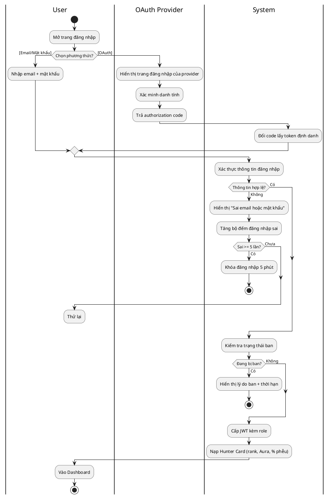
```plantuml
@startuml
|User|
start
:Mở trang đăng nhập;
if (Chọn phương thức?) then ([Email/Mật khẩu])
  :Nhập email + mật khẩu;
else ([OAuth])
  |OAuth Provider|
  :Hiển thị trang đăng nhập của provider;
  :Xác minh danh tính;
  :Trả authorization code;
  |System|
  :Đổi code lấy token định danh;
endif
|System|
:Xác thực thông tin đăng nhập;
if (Thông tin hợp lệ?) then (Không)
  :Hiển thị "Sai email hoặc mật khẩu";
  :Tăng bộ đếm đăng nhập sai;
  if (Sai >= 5 lần?) then (Có)
    :Khóa đăng nhập 5 phút;
    stop
  else (Chưa)
  endif
  |User|
  :Thử lại;
  detach
else (Có)
endif
|System|
:Kiểm tra trạng thái ban;
if (Đang bị ban?) then (Có)
  :Hiển thị lý do ban + thời hạn;
  stop
else (Không)
endif
:Cấp JWT kèm role;
:Nạp Hunter Card (rank, Aura, % phễu);
|User|
:Vào Dashboard;
stop
@enduml
```

*Diễn giải:* Activity diagram mô tả luồng đăng nhập với hai nhánh (email/mật khẩu và OAuth), vòng lặp thử lại khi sai thông tin kèm cơ chế khóa tạm sau 5 lần sai, và chốt chặn kiểm tra trạng thái ban trước khi cấp JWT.

### AD-AHI-02 — View / Update Hunter Profile

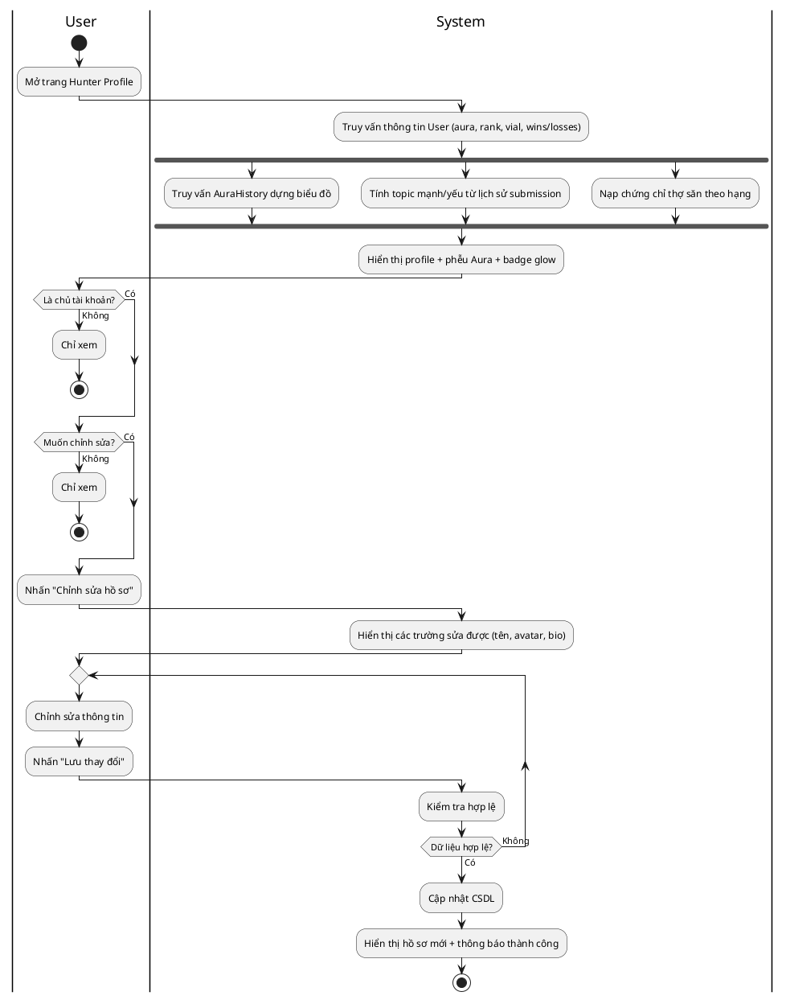
```plantuml
@startuml
|User|
start
:Mở trang Hunter Profile;
|System|
:Truy vấn thông tin User (aura, rank, vial, wins/losses);
fork
  :Truy vấn AuraHistory dựng biểu đồ;
fork again
  :Tính topic mạnh/yếu từ lịch sử submission;
fork again
  :Nạp chứng chỉ thợ săn theo hạng;
end fork
:Hiển thị profile + phễu Aura + badge glow;
|User|
if (Là chủ tài khoản?) then (Không)
  :Chỉ xem;
  stop
else (Có)
endif
if (Muốn chỉnh sửa?) then (Không)
  :Chỉ xem;
  stop
else (Có)
endif
:Nhấn "Chỉnh sửa hồ sơ";
|System|
:Hiển thị các trường sửa được (tên, avatar, bio);
|User|
repeat
  :Chỉnh sửa thông tin;
  :Nhấn "Lưu thay đổi";
  |System|
  :Kiểm tra hợp lệ;
repeat while (Dữ liệu hợp lệ?) is (Không) not (Có)
:Cập nhật CSDL;
:Hiển thị hồ sơ mới + thông báo thành công;
stop
@enduml
```

*Diễn giải:* Diagram mô tả việc nạp song song ba nguồn dữ liệu để dựng profile, nhánh quyết định phân biệt người xem là chủ tài khoản hay khách, và vòng lặp validation khi chỉnh sửa.

### AD-PRS-01 — Solve & Submit a Problem (Practice)

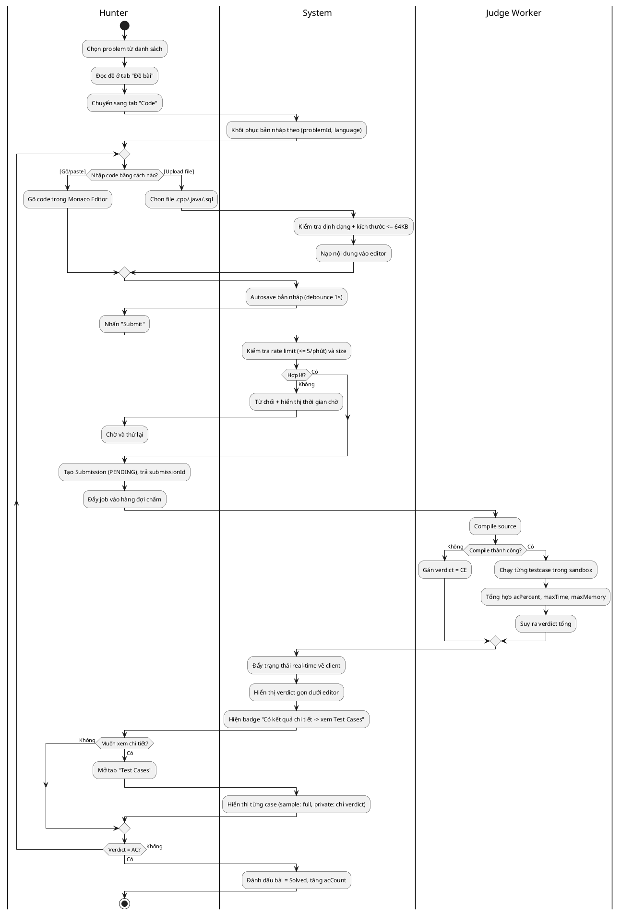
```plantuml
@startuml
|Hunter|
start
:Chọn problem từ danh sách;
:Đọc đề ở tab "Đề bài";
:Chuyển sang tab "Code";
|System|
:Khôi phục bản nháp theo (problemId, language);
|Hunter|
repeat
  if (Nhập code bằng cách nào?) then ([Gõ/paste])
    :Gõ code trong Monaco Editor;
  else ([Upload file])
    :Chọn file .cpp/.java/.sql;
    |System|
    :Kiểm tra định dạng + kích thước <= 64KB;
    :Nạp nội dung vào editor;
    |Hunter|
  endif
  |System|
  :Autosave bản nháp (debounce 1s);
  |Hunter|
  :Nhấn "Submit";
  |System|
  :Kiểm tra rate limit (<= 5/phút) và size;
  if (Hợp lệ?) then (Không)
    :Từ chối + hiển thị thời gian chờ;
    |Hunter|
    :Chờ và thử lại;
    detach
  else (Có)
  endif
  :Tạo Submission (PENDING), trả submissionId;
  :Đẩy job vào hàng đợi chấm;
  |Judge Worker|
  :Compile source;
  if (Compile thành công?) then (Không)
    :Gán verdict = CE;
  else (Có)
    :Chạy từng testcase trong sandbox;
    :Tổng hợp acPercent, maxTime, maxMemory;
    :Suy ra verdict tổng;
  endif
  |System|
  :Đẩy trạng thái real-time về client;
  :Hiển thị verdict gọn dưới editor;
  :Hiện badge "Có kết quả chi tiết -> xem Test Cases";
  |Hunter|
  if (Muốn xem chi tiết?) then (Có)
    :Mở tab "Test Cases";
    |System|
    :Hiển thị từng case (sample: full, private: chỉ verdict);
    |Hunter|
  else (Không)
  endif
repeat while (Verdict = AC?) is (Không) not (Có)
|System|
:Đánh dấu bài = Solved, tăng acCount;
|Hunter|
stop
@enduml
```

*Diễn giải:* Đây là vòng lặp luyện tập trung tâm. Diagram thể hiện swimlane ba bên (Hunter / System / Judge Worker), hai nhánh nhập code, chốt chặn rate limit, nhánh CE tách khỏi luồng chấm testcase, và vòng lặp lặp lại cho tới khi đạt AC.

### AD-PRS-02 — View Other User's Source Code

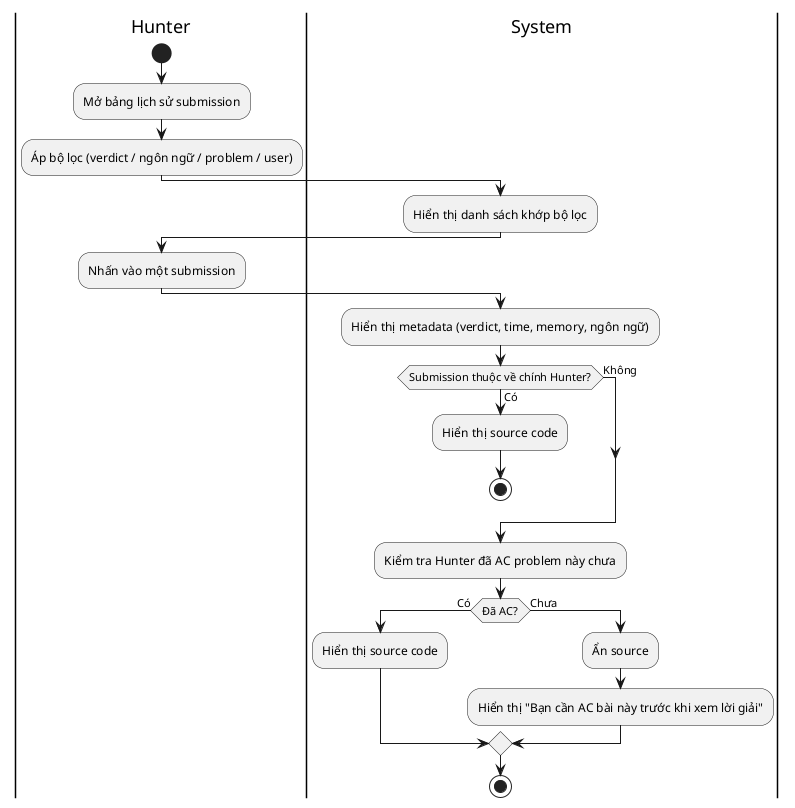
```plantuml
@startuml
|Hunter|
start
:Mở bảng lịch sử submission;
:Áp bộ lọc (verdict / ngôn ngữ / problem / user);
|System|
:Hiển thị danh sách khớp bộ lọc;
|Hunter|
:Nhấn vào một submission;
|System|
:Hiển thị metadata (verdict, time, memory, ngôn ngữ);
if (Submission thuộc về chính Hunter?) then (Có)
  :Hiển thị source code;
  stop
else (Không)
endif
:Kiểm tra Hunter đã AC problem này chưa;
if (Đã AC?) then (Có)
  :Hiển thị source code;
else (Chưa)
  :Ẩn source;
  :Hiển thị "Bạn cần AC bài này trước khi xem lời giải";
endif
stop
@enduml
```

*Diễn giải:* Diagram thể hiện cơ chế ẩn solution: metadata luôn công khai, nhưng source chỉ mở khi người xem là chủ submission hoặc đã AC bài đó.

### AD-BAR-01 — Matchmaking

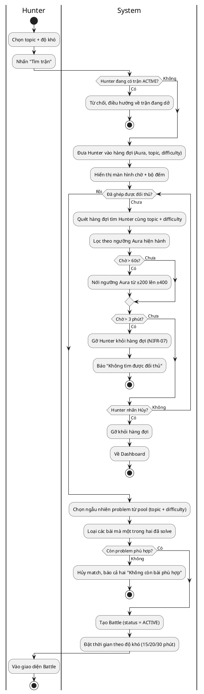
```plantuml
@startuml
|Hunter|
start
:Chọn topic + độ khó;
:Nhấn "Tìm trận";
|System|
if (Hunter đang có trận ACTIVE?) then (Có)
  :Từ chối, điều hướng về trận đang dở;
  stop
else (Không)
endif
:Đưa Hunter vào hàng đợi (Aura, topic, difficulty);
:Hiển thị màn hình chờ + bộ đếm;
while (Đã ghép được đối thủ?) is (Chưa)
  :Quét hàng đợi tìm Hunter cùng topic + difficulty;
  :Lọc theo ngưỡng Aura hiện hành;
  if (Chờ > 60s?) then (Có)
    :Nới ngưỡng Aura từ ±200 lên ±400;
  else (Chưa)
  endif
  if (Chờ > 3 phút?) then (Có)
    :Gỡ Hunter khỏi hàng đợi (NIFR-07);
    :Báo "Không tìm được đối thủ";
    stop
  else (Chưa)
  endif
  if (Hunter nhấn Hủy?) then (Có)
    :Gỡ khỏi hàng đợi;
    :Về Dashboard;
    stop
  else (Không)
  endif
endwhile (Rồi)
:Chọn ngẫu nhiên problem từ pool (topic + difficulty);
:Loại các bài mà một trong hai đã solve;
if (Còn problem phù hợp?) then (Không)
  :Hủy match, báo cả hai "Không còn bài phù hợp";
  stop
else (Có)
endif
:Tạo Battle (status = ACTIVE);
:Đặt thời gian theo độ khó (15/20/30 phút);
|Hunter|
:Vào giao diện Battle;
stop
@enduml
```

*Diễn giải:* Diagram thể hiện vòng lặp ghép trận với hai mốc thời gian (nới ngưỡng ở 60s, hủy ở 3 phút), nhánh hủy chủ động của Hunter, và bước chọn problem loại trừ các bài đã solve.

### AD-BAR-02 — Play a Live Battle

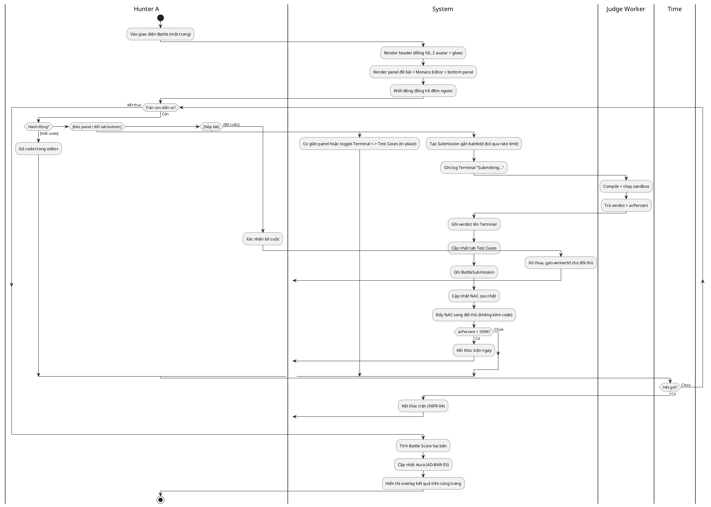
```plantuml
@startuml
|Hunter A|
start
:Vào giao diện Battle (một trang);
|System|
:Render header (đồng hồ, 2 avatar + glow);
:Render panel đề bài + Monaco Editor + bottom panel;
:Khởi động đồng hồ đếm ngược;
|Hunter A|
while (Trận còn diễn ra?) is (Còn)
  if (Hành động?) then ([Viết code])
    :Gõ code trong editor;
  elseif ([Kéo panel / đổi tab bottom])
    |System|
    :Co giãn panel hoặc toggle Terminal <-> Test Cases (in-place);
    |Hunter A|
  elseif ([Nộp bài])
    |System|
    :Tạo Submission gắn battleId (bỏ qua rate limit);
    :Ghi log Terminal "Submitting...";
    |Judge Worker|
    :Compile + chạy sandbox;
    :Trả verdict + acPercent;
    |System|
    :Ghi verdict lên Terminal;
    :Cập nhật tab Test Cases;
    :Ghi BattleSubmission;
    :Cập nhật %AC cao nhất;
    :Đẩy %AC sang đối thủ (không kèm code);
    if (acPercent = 100%?) then (Có)
      :Kết thúc trận ngay;
      break
    else (Chưa)
    endif
    |Hunter A|
  else ([Bỏ cuộc])
    :Xác nhận bỏ cuộc;
    |System|
    :Xử thua, gán winnerId cho đối thủ;
    break
  endif
  |Time|
  if (Hết giờ?) then (Có)
    |System|
    :Kết thúc trận (NIFR-04);
    break
  else (Chưa)
  endif
  |Hunter A|
endwhile (Kết thúc)
|System|
:Tính Battle Score hai bên;
:Cập nhật Aura (AD-BAR-03);
:Hiển thị overlay kết quả trên cùng trang;
|Hunter A|
stop
@enduml
```

*Diễn giải:* Diagram nhấn mạnh nguyên tắc *không đổi route trong suốt trận*: mọi hành động (viết code, kéo panel, đổi tab bottom, nộp bài, bỏ cuộc) đều xảy ra tại chỗ. Ba điều kiện kết thúc trận được thể hiện rõ: AC 100%, forfeit, và hết giờ do Time actor kích hoạt.

### AD-BAR-03 — Update Aura, Promote / Demote Rank

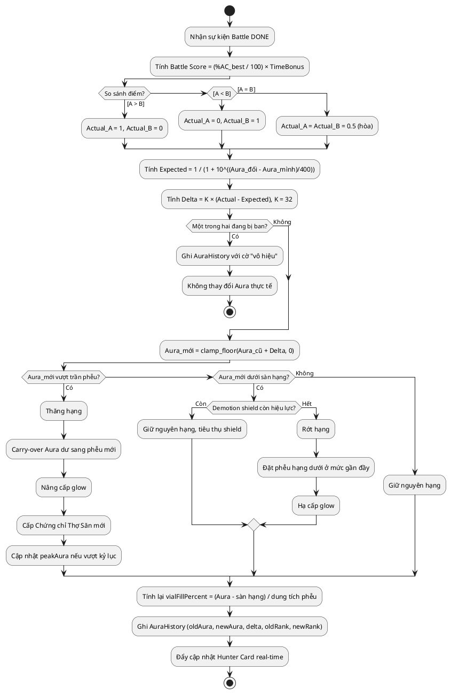
```plantuml
@startuml
|System|
start
:Nhận sự kiện Battle DONE;
:Tính Battle Score = (%AC_best / 100) × TimeBonus;
if (So sánh điểm?) then ([A > B])
  :Actual_A = 1, Actual_B = 0;
elseif ([A < B])
  :Actual_A = 0, Actual_B = 1;
else ([A = B])
  :Actual_A = Actual_B = 0.5 (hòa);
endif
:Tính Expected = 1 / (1 + 10^((Aura_đối - Aura_mình)/400));
:Tính Delta = K × (Actual - Expected), K = 32;
if (Một trong hai đang bị ban?) then (Có)
  :Ghi AuraHistory với cờ "vô hiệu";
  :Không thay đổi Aura thực tế;
  stop
else (Không)
endif
:Aura_mới = clamp_floor(Aura_cũ + Delta, 0);
if (Aura_mới vượt trần phễu?) then (Có)
  :Thăng hạng;
  :Carry-over Aura dư sang phễu mới;
  :Nâng cấp glow;
  :Cấp Chứng chỉ Thợ Săn mới;
  :Cập nhật peakAura nếu vượt kỷ lục;
elseif (Aura_mới dưới sàn hạng?) then (Có)
  if (Demotion shield còn hiệu lực?) then (Còn)
    :Giữ nguyên hạng, tiêu thụ shield;
  else (Hết)
    :Rớt hạng;
    :Đặt phễu hạng dưới ở mức gần đầy;
    :Hạ cấp glow;
  endif
else (Không)
  :Giữ nguyên hạng;
endif
:Tính lại vialFillPercent = (Aura - sàn hạng) / dung tích phễu;
:Ghi AuraHistory (oldAura, newAura, delta, oldRank, newRank);
:Đẩy cập nhật Hunter Card real-time;
stop
@enduml
```

*Diễn giải:* Diagram mô tả toàn bộ chuỗi tính toán sau trận: xác định Actual → tính Expected và Delta theo biến thể Elo → chốt chặn kiểm tra ban → cập nhật Aura → ba nhánh thăng hạng / rớt hạng (có demotion shield) / giữ nguyên → ghi lịch sử.

### AD-SPA-01 — Spectate a Battle

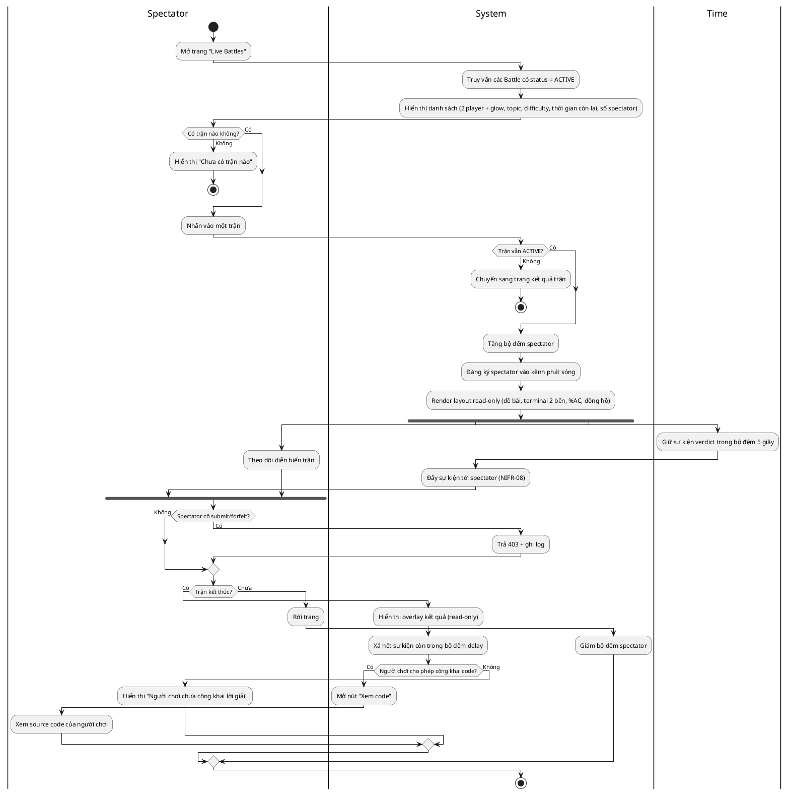
```plantuml
@startuml
|Spectator|
start
:Mở trang "Live Battles";
|System|
:Truy vấn các Battle có status = ACTIVE;
:Hiển thị danh sách (2 player + glow, topic, difficulty, thời gian còn lại, số spectator);
|Spectator|
if (Có trận nào không?) then (Không)
  :Hiển thị "Chưa có trận nào";
  stop
else (Có)
endif
:Nhấn vào một trận;
|System|
if (Trận vẫn ACTIVE?) then (Không)
  :Chuyển sang trang kết quả trận;
  stop
else (Có)
endif
:Tăng bộ đếm spectator;
:Đăng ký spectator vào kênh phát sóng;
:Render layout read-only (đề bài, terminal 2 bên, %AC, đồng hồ);
fork
  |Time|
  :Giữ sự kiện verdict trong bộ đệm 5 giây;
  |System|
  :Đẩy sự kiện tới spectator (NIFR-08);
fork again
  |Spectator|
  :Theo dõi diễn biến trận;
end fork
if (Spectator cố submit/forfeit?) then (Có)
  |System|
  :Trả 403 + ghi log;
  |Spectator|
else (Không)
endif
if (Trận kết thúc?) then (Có)
  |System|
  :Hiển thị overlay kết quả (read-only);
  :Xả hết sự kiện còn trong bộ đệm delay;
  if (Người chơi cho phép công khai code?) then (Có)
    :Mở nút "Xem code";
    |Spectator|
    :Xem source code của người chơi;
  else (Không)
    |Spectator|
    :Hiển thị "Người chơi chưa công khai lời giải";
  endif
else (Chưa)
  :Rời trang;
  |System|
  :Giảm bộ đếm spectator;
endif
stop
@enduml
```

*Diễn giải:* Diagram thể hiện hai đặc thù cốt lõi của spectate: **delay 5 giây** do Time actor điều phối, và **read-only tuyệt đối** (mọi thao tác ghi đều bị chặn 403). Nhánh cuối xử lý việc mở code sau trận theo cờ cho phép của người chơi.

### AD-SPA-02 — Manage & Publish a Problem

```plantuml
@startuml
|Admin|
start
:Mở trang "Quản lý Problem";
if (Hành động?) then ([Tạo mới])
  :Nhấn "Tạo problem mới";
else ([Sửa])
  :Chọn problem có sẵn;
  |System|
  :Nạp dữ liệu hiện tại vào form;
  |Admin|
else ([Xóa])
  |System|
  if (Problem đã có submission?) then (Có)
    :Chặn xóa cứng, chỉ cho phép Archive;
    stop
  else (Không)
    :Xóa problem sau xác nhận;
    stop
  endif
endif
repeat
  :Nhập tiêu đề, đề bài (Markdown+LaTeX), I/O format, ràng buộc;
  :Đặt time limit, memory limit, difficulty, tag;
  :Thêm testcase (upload file hoặc nhập tay, đánh dấu sample/private);
  :Nhấn "Preview";
  |System|
  :Render đề như trang đề bài thật;
  if (Cú pháp LaTeX hợp lệ?) then (Không)
    :Cảnh báo lỗi LaTeX;
    |Admin|
    :Sửa lại đề;
    detach
  else (Có)
  endif
  |Admin|
  :Chọn trạng thái (Draft / Review / Public);
  :Nhấn "Lưu";
  |System|
  if (Trạng thái = Public?) then (Có)
    :Kiểm tra có >= 1 sample và >= 1 private testcase;
  else (Không)
    :Bỏ qua kiểm tra testcase;
  endif
repeat while (Hợp lệ để lưu?) is (Không) not (Có)
:Lưu problem;
if (Trạng thái = Public?) then (Có)
  :Hiển thị problem cho User;
  :Đưa problem vào pool battle;
else (Không)
  :Ẩn khỏi User và pool battle;
endif
|Admin|
stop
@enduml
```

*Diễn giải:* Diagram thể hiện ba nhánh hành động (tạo/sửa/xóa), vòng lặp preview–sửa cho tới khi đề hợp lệ, và chốt chặn bắt buộc phải có đủ sample + private testcase trước khi publish.

### AD-SPA-03 — Ban User Account

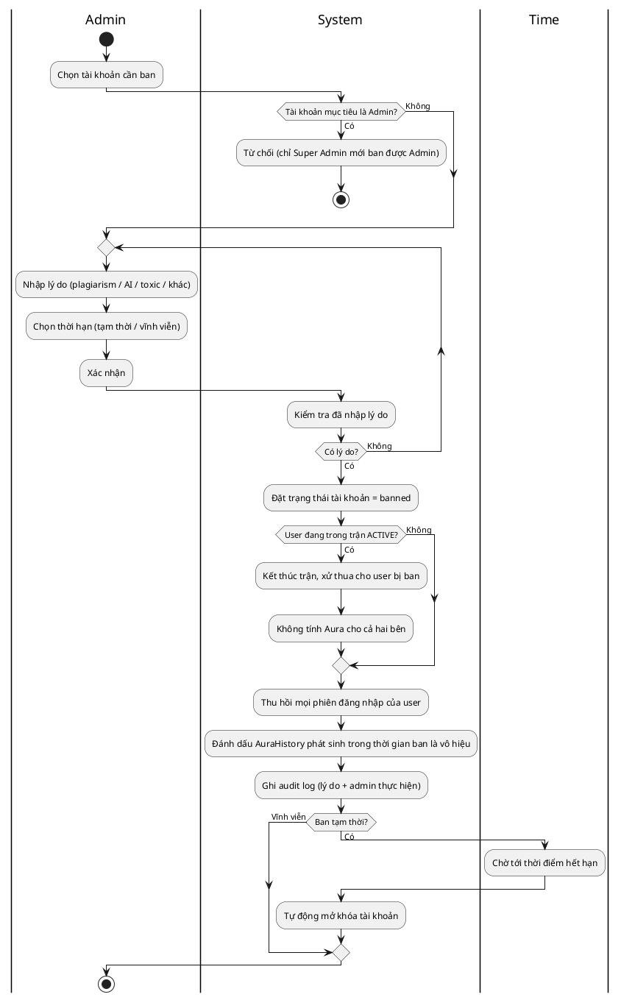
```plantuml
@startuml
|Admin|
start
:Chọn tài khoản cần ban;
|System|
if (Tài khoản mục tiêu là Admin?) then (Có)
  :Từ chối (chỉ Super Admin mới ban được Admin);
  stop
else (Không)
endif
|Admin|
repeat
  :Nhập lý do (plagiarism / AI / toxic / khác);
  :Chọn thời hạn (tạm thời / vĩnh viễn);
  :Xác nhận;
  |System|
  :Kiểm tra đã nhập lý do;
repeat while (Có lý do?) is (Không) not (Có)
:Đặt trạng thái tài khoản = banned;
if (User đang trong trận ACTIVE?) then (Có)
  :Kết thúc trận, xử thua cho user bị ban;
  :Không tính Aura cho cả hai bên;
else (Không)
endif
:Thu hồi mọi phiên đăng nhập của user;
:Đánh dấu AuraHistory phát sinh trong thời gian ban là vô hiệu;
:Ghi audit log (lý do + admin thực hiện);
if (Ban tạm thời?) then (Có)
  |Time|
  :Chờ tới thời điểm hết hạn;
  |System|
  :Tự động mở khóa tài khoản;
else (Vĩnh viễn)
endif
|Admin|
stop
@enduml
```

*Diễn giải:* Diagram thể hiện vòng lặp bắt buộc nhập lý do, xử lý trường hợp user đang thi đấu khi bị ban, cơ chế vô hiệu hóa Aura phát sinh trong thời gian ban, và nhánh tự động mở khóa với ban tạm thời (do Time actor kích hoạt).

---

# 6. Sequence Diagrams

## 6.1 List of Sequence Diagrams

| Diagram ID | Name |
|---|---|
| SD-AHI-01 | Log into the System & Authenticate via OAuth |
| SD-PRS-01 | Submit Solution & Real-time Judging |
| SD-PRS-02 | View Other User's Source Code |
| SD-BAR-01 | Matchmaking & Battle Initialization |
| SD-BAR-02 | Submit Solution in Battle & Opponent Progress Sync |
| SD-BAR-03 | End Battle & Update Aura / Rank |
| SD-SPA-01 | Spectate a Battle with 5-second Delay |
| SD-SPA-02 | Ban User Account |

## 6.2 Sequence Diagrams

### SD-AHI-01 — Log into the System & Authenticate via OAuth

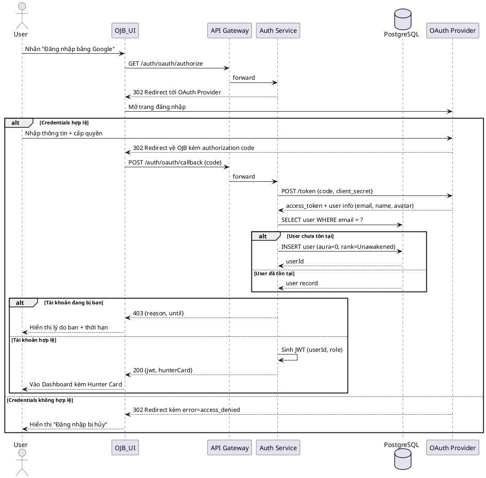
```plantuml
@startuml
actor User
participant "OJB_UI" as UI
participant "API Gateway" as GW
participant "Auth Service" as Auth
database "PostgreSQL" as DB
participant "OAuth Provider" as OAuth

User -> UI : Nhấn "Đăng nhập bằng Google"
UI -> GW : GET /auth/oauth/authorize
GW -> Auth : forward
Auth --> UI : 302 Redirect tới OAuth Provider
UI -> OAuth : Mở trang đăng nhập

alt Credentials hợp lệ
    User -> OAuth : Nhập thông tin + cấp quyền
    OAuth --> UI : 302 Redirect về OJB kèm authorization code
    UI -> GW : POST /auth/oauth/callback {code}
    GW -> Auth : forward
    Auth -> OAuth : POST /token {code, client_secret}
    OAuth --> Auth : access_token + user info (email, name, avatar)

    Auth -> DB : SELECT user WHERE email = ?
    alt User chưa tồn tại
        Auth -> DB : INSERT user (aura=0, rank=Unawakened)
        DB --> Auth : userId
    else User đã tồn tại
        DB --> Auth : user record
    end

    alt Tài khoản đang bị ban
        Auth --> UI : 403 {reason, until}
        UI --> User : Hiển thị lý do ban + thời hạn
    else Tài khoản hợp lệ
        Auth -> Auth : Sinh JWT (userId, role)
        Auth --> UI : 200 {jwt, hunterCard}
        UI --> User : Vào Dashboard kèm Hunter Card
    end

else Credentials không hợp lệ
    OAuth --> UI : 302 Redirect kèm error=access_denied
    UI --> User : Hiển thị "Đăng nhập bị hủy"
end
@enduml
```

*Diễn giải:* Diagram mô tả luồng OAuth2 authorization-code đầy đủ: redirect sang provider, đổi code lấy token, tự động tạo tài khoản mới nếu email chưa tồn tại, và hai chốt chặn quan trọng — provider từ chối (`access_denied`) và tài khoản bị ban — được mô hình hóa bằng các `alt` fragment.

### SD-PRS-01 — Submit Solution & Real-time Judging

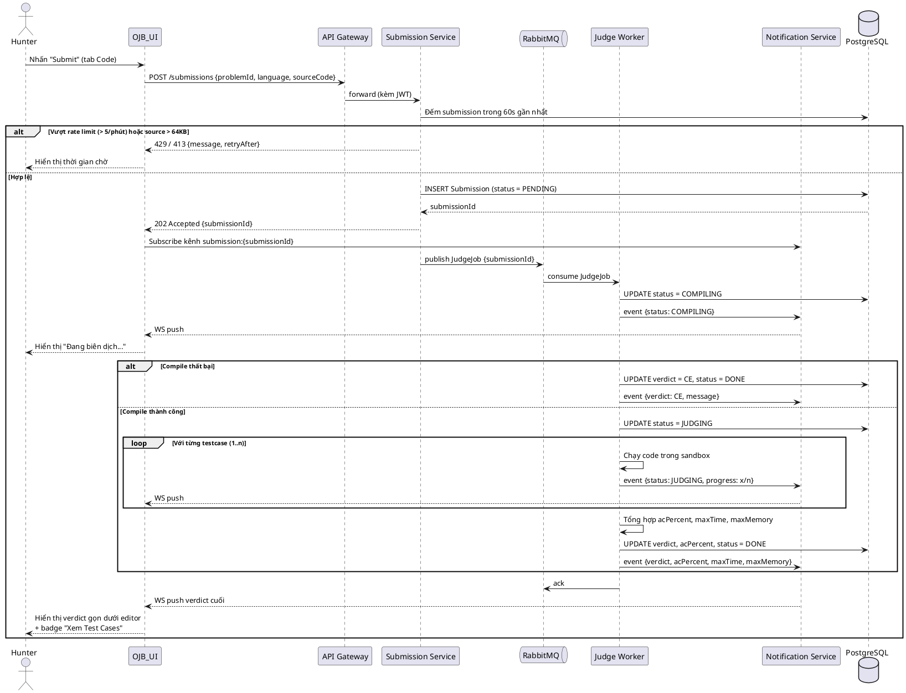
```plantuml
@startuml
actor Hunter
participant "OJB_UI" as UI
participant "API Gateway" as GW
participant "Submission Service" as Sub
queue "RabbitMQ" as MQ
participant "Judge Worker" as Judge
participant "Notification Service" as Notif
database "PostgreSQL" as DB

Hunter -> UI : Nhấn "Submit" (tab Code)
UI -> GW : POST /submissions {problemId, language, sourceCode}
GW -> Sub : forward (kèm JWT)

Sub -> DB : Đếm submission trong 60s gần nhất
alt Vượt rate limit (> 5/phút) hoặc source > 64KB
    Sub --> UI : 429 / 413 {message, retryAfter}
    UI --> Hunter : Hiển thị thời gian chờ
else Hợp lệ
    Sub -> DB : INSERT Submission (status = PENDING)
    DB --> Sub : submissionId
    Sub --> UI : 202 Accepted {submissionId}
    UI -> Notif : Subscribe kênh submission:{submissionId}

    Sub -> MQ : publish JudgeJob {submissionId}
    MQ -> Judge : consume JudgeJob

    Judge -> DB : UPDATE status = COMPILING
    Judge -> Notif : event {status: COMPILING}
    Notif --> UI : WS push
    UI --> Hunter : Hiển thị "Đang biên dịch..."

    alt Compile thất bại
        Judge -> DB : UPDATE verdict = CE, status = DONE
        Judge -> Notif : event {verdict: CE, message}
    else Compile thành công
        Judge -> DB : UPDATE status = JUDGING
        loop Với từng testcase (1..n)
            Judge -> Judge : Chạy code trong sandbox
            Judge -> Notif : event {status: JUDGING, progress: x/n}
            Notif --> UI : WS push
        end
        Judge -> Judge : Tổng hợp acPercent, maxTime, maxMemory
        Judge -> DB : UPDATE verdict, acPercent, status = DONE
        Judge -> Notif : event {verdict, acPercent, maxTime, maxMemory}
    end

    Judge -> MQ : ack
    Notif --> UI : WS push verdict cuối
    UI --> Hunter : Hiển thị verdict gọn dưới editor\n+ badge "Xem Test Cases"
end
@enduml
```

*Diễn giải:* Diagram thể hiện mô hình bất đồng bộ cốt lõi: Submission Service trả `submissionId` ngay (202 Accepted) rồi đẩy job vào RabbitMQ; Judge Worker phát sự kiện tiến độ qua Notification Service để client cập nhật real-time. Hai `alt` fragment xử lý rate limit và lỗi biên dịch; `loop` thể hiện việc chấm từng testcase.

### SD-PRS-02 — View Other User's Source Code

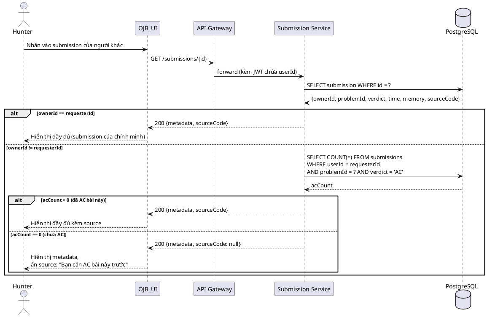
```plantuml
@startuml
actor Hunter
participant "OJB_UI" as UI
participant "API Gateway" as GW
participant "Submission Service" as Sub
database "PostgreSQL" as DB

Hunter -> UI : Nhấn vào submission của người khác
UI -> GW : GET /submissions/{id}
GW -> Sub : forward (kèm JWT chứa userId)

Sub -> DB : SELECT submission WHERE id = ?
DB --> Sub : {ownerId, problemId, verdict, time, memory, sourceCode}

alt ownerId == requesterId
    Sub --> UI : 200 {metadata, sourceCode}
    UI --> Hunter : Hiển thị đầy đủ (submission của chính mình)
else ownerId != requesterId
    Sub -> DB : SELECT COUNT(*) FROM submissions\nWHERE userId = requesterId\nAND problemId = ? AND verdict = 'AC'
    DB --> Sub : acCount

    alt acCount > 0 (đã AC bài này)
        Sub --> UI : 200 {metadata, sourceCode}
        UI --> Hunter : Hiển thị đầy đủ kèm source
    else acCount == 0 (chưa AC)
        Sub --> UI : 200 {metadata, sourceCode: null}
        UI --> Hunter : Hiển thị metadata,\nẩn source: "Bạn cần AC bài này trước"
    end
end
@enduml
```

*Diễn giải:* Diagram thể hiện cơ chế ẩn solution được thực thi ở tầng service (không phải chỉ ở UI): server chỉ trả về `sourceCode` khi người yêu cầu là chủ submission hoặc đã có ít nhất một submission AC cho cùng problem. Trường hợp còn lại, trường `sourceCode` được trả về `null` — bảo đảm không thể vượt rào bằng cách gọi API trực tiếp.

### SD-BAR-01 — Matchmaking & Battle Initialization

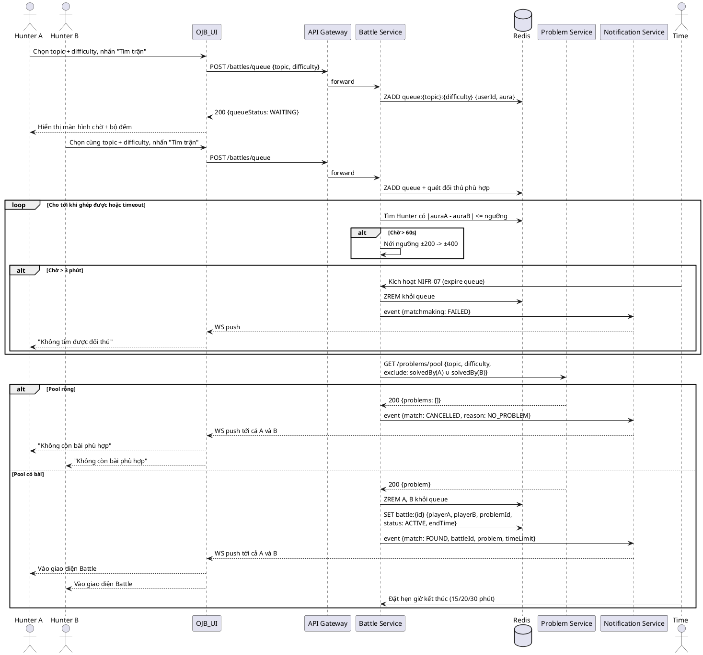
```plantuml
@startuml
actor "Hunter A" as A
actor "Hunter B" as B
participant "OJB_UI" as UI
participant "API Gateway" as GW
participant "Battle Service" as Battle
database "Redis" as Redis
participant "Problem Service" as Prob
participant "Notification Service" as Notif
actor Time

A -> UI : Chọn topic + difficulty, nhấn "Tìm trận"
UI -> GW : POST /battles/queue {topic, difficulty}
GW -> Battle : forward
Battle -> Redis : ZADD queue:{topic}:{difficulty} {userId, aura}
Battle --> UI : 200 {queueStatus: WAITING}
UI --> A : Hiển thị màn hình chờ + bộ đếm

B -> UI : Chọn cùng topic + difficulty, nhấn "Tìm trận"
UI -> GW : POST /battles/queue
GW -> Battle : forward
Battle -> Redis : ZADD queue + quét đối thủ phù hợp

loop Cho tới khi ghép được hoặc timeout
    Battle -> Redis : Tìm Hunter có |auraA - auraB| <= ngưỡng
    alt Chờ > 60s
        Battle -> Battle : Nới ngưỡng ±200 -> ±400
    end
    alt Chờ > 3 phút
        Time -> Battle : Kích hoạt NIFR-07 (expire queue)
        Battle -> Redis : ZREM khỏi queue
        Battle -> Notif : event {matchmaking: FAILED}
        Notif --> UI : WS push
        UI --> A : "Không tìm được đối thủ"
    end
end

Battle -> Prob : GET /problems/pool {topic, difficulty,\nexclude: solvedBy(A) ∪ solvedBy(B)}
alt Pool rỗng
    Prob --> Battle : 200 {problems: []}
    Battle -> Notif : event {match: CANCELLED, reason: NO_PROBLEM}
    Notif --> UI : WS push tới cả A và B
    UI --> A : "Không còn bài phù hợp"
    UI --> B : "Không còn bài phù hợp"
else Pool có bài
    Prob --> Battle : 200 {problem}
    Battle -> Redis : ZREM A, B khỏi queue
    Battle -> Redis : SET battle:{id} {playerA, playerB, problemId,\nstatus: ACTIVE, endTime}
    Battle -> Notif : event {match: FOUND, battleId, problem, timeLimit}
    Notif --> UI : WS push tới cả A và B
    UI --> A : Vào giao diện Battle
    UI --> B : Vào giao diện Battle
    Time -> Battle : Đặt hẹn giờ kết thúc (15/20/30 phút)
end
@enduml
```

*Diễn giải:* Diagram mô tả toàn bộ pipeline ghép trận: hàng đợi lưu trên Redis sorted-set theo Aura, vòng `loop` quét đối thủ với ngưỡng nới dần, Time actor kích hoạt timeout ở mốc 3 phút, và bước then chốt — Battle Service hỏi Problem Service lấy bài **loại trừ tập đã solve của cả hai** trước khi khởi tạo trận.

### SD-BAR-02 — Submit Solution in Battle & Opponent Progress Sync

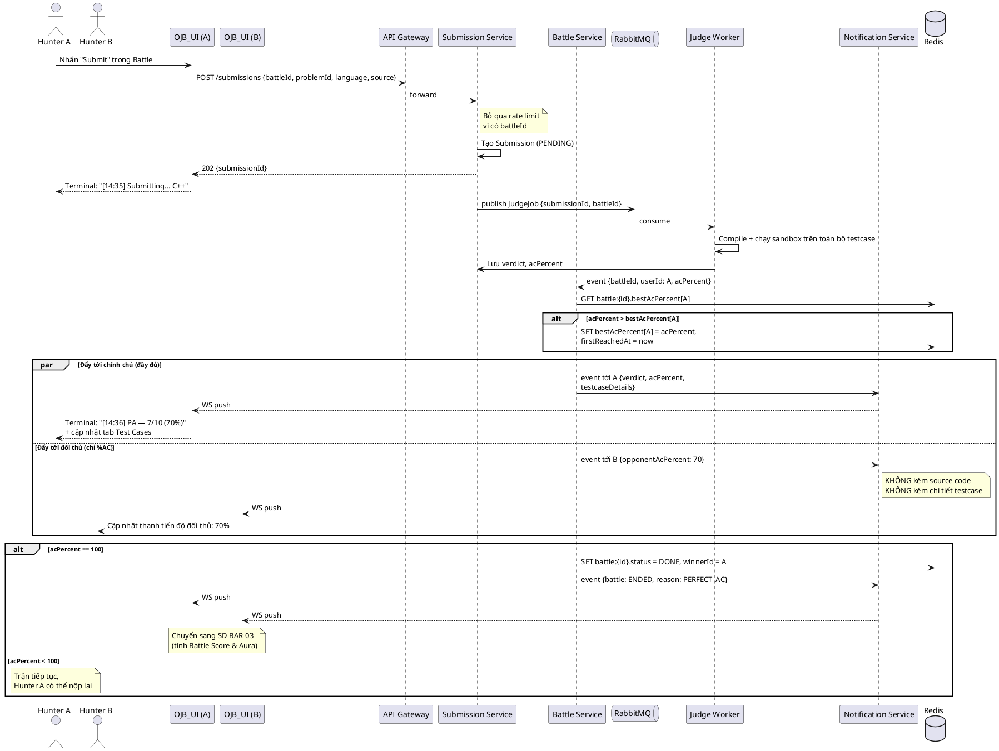
```plantuml
@startuml
actor "Hunter A" as A
actor "Hunter B" as B
participant "OJB_UI (A)" as UIA
participant "OJB_UI (B)" as UIB
participant "API Gateway" as GW
participant "Submission Service" as Sub
participant "Battle Service" as Battle
queue "RabbitMQ" as MQ
participant "Judge Worker" as Judge
participant "Notification Service" as Notif
database "Redis" as Redis

A -> UIA : Nhấn "Submit" trong Battle
UIA -> GW : POST /submissions {battleId, problemId, language, source}
GW -> Sub : forward
note right of Sub : Bỏ qua rate limit\nvì có battleId
Sub -> Sub : Tạo Submission (PENDING)
Sub --> UIA : 202 {submissionId}
UIA --> A : Terminal: "[14:35] Submitting... C++"

Sub -> MQ : publish JudgeJob {submissionId, battleId}
MQ -> Judge : consume
Judge -> Judge : Compile + chạy sandbox trên toàn bộ testcase
Judge -> Sub : Lưu verdict, acPercent
Judge -> Battle : event {battleId, userId: A, acPercent}

Battle -> Redis : GET battle:{id}.bestAcPercent[A]
alt acPercent > bestAcPercent[A]
    Battle -> Redis : SET bestAcPercent[A] = acPercent,\nfirstReachedAt = now
end

par Đẩy tới chính chủ (đầy đủ)
    Battle -> Notif : event tới A {verdict, acPercent,\ntestcaseDetails}
    Notif --> UIA : WS push
    UIA --> A : Terminal: "[14:36] PA — 7/10 (70%)"\n+ cập nhật tab Test Cases
else Đẩy tới đối thủ (chỉ %AC)
    Battle -> Notif : event tới B {opponentAcPercent: 70}
    note right of Notif : KHÔNG kèm source code\nKHÔNG kèm chi tiết testcase
    Notif --> UIB : WS push
    UIB --> B : Cập nhật thanh tiến độ đối thủ: 70%
end

alt acPercent == 100
    Battle -> Redis : SET battle:{id}.status = DONE, winnerId = A
    Battle -> Notif : event {battle: ENDED, reason: PERFECT_AC}
    Notif --> UIA : WS push
    Notif --> UIB : WS push
    note over UIA, UIB : Chuyển sang SD-BAR-03\n(tính Battle Score & Aura)
else acPercent < 100
    note over A : Trận tiếp tục,\nHunter A có thể nộp lại
end
@enduml
```

*Diễn giải:* Đây là diagram quan trọng nhất về mặt bảo mật thông tin. `par` fragment thể hiện rõ **hai luồng dữ liệu bất đối xứng**: chính chủ nhận verdict đầy đủ kèm chi tiết testcase, còn đối thủ chỉ nhận đúng một con số `%AC` — không source code, không chi tiết testcase. Battle Service chỉ ghi đè `bestAcPercent` khi lần nộp mới cao hơn, đúng nguyên tắc "chỉ tính lần đạt %AC cao nhất sớm nhất".

### SD-BAR-03 — End Battle & Update Aura / Rank

```plantuml
@startuml
actor "Hunter A" as A
actor "Hunter B" as B
participant "OJB_UI" as UI
participant "Battle Service" as Battle
database "Redis" as Redis
database "PostgreSQL" as DB
participant "Notification Service" as Notif
actor Time

alt Kết thúc do AC 100%
    Battle -> Battle : Nhận event PERFECT_AC
else Kết thúc do hết giờ
    Time -> Battle : Timer expired (NIFR-04)
else Kết thúc do forfeit
    A -> UI : Nhấn "Bỏ cuộc" + xác nhận
    UI -> Battle : POST /battles/{id}/forfeit
end

Battle -> Redis : GET battle:{id} {bestAcPercent, firstReachedAt, endTime}

Battle -> Battle : TimeBonus = 1 + (TimeRemaining / TotalTime) × 0.5
Battle -> Battle : Score = (%AC_best / 100) × TimeBonus

alt Score_A > Score_B
    Battle -> Battle : Actual_A = 1, Actual_B = 0
else Score_A < Score_B
    Battle -> Battle : Actual_A = 0, Actual_B = 1
else Score_A == Score_B
    Battle -> Battle : Actual = 0.5 cho cả hai (hòa)
end

Battle -> DB : SELECT aura, rank FROM users WHERE id IN (A, B)
DB --> Battle : {auraA, rankA, auraB, rankB}

Battle -> Battle : Expected_A = 1 / (1 + 10^((auraB - auraA)/400))
Battle -> Battle : Delta_A = 32 × (Actual_A - Expected_A)

alt Một trong hai đang bị ban
    Battle -> DB : INSERT AuraHistory (flag = INVALID)
    note right of DB : Aura thực tế KHÔNG thay đổi
else Cả hai hợp lệ
    Battle -> Battle : aura_new = clamp_floor(aura_old + Delta, 0)

    alt aura_new vượt trần phễu
        Battle -> Battle : Thăng hạng, carry-over Aura dư
        Battle -> DB : UPDATE rank, vialFillPercent, peakAura
        Battle -> DB : INSERT HunterCertificate (newRank)
        note right of Battle : Nâng cấp glow token
    else aura_new dưới sàn hạng
        alt Demotion shield còn hiệu lực
            Battle -> Battle : Giữ nguyên hạng, tiêu thụ shield
        else Shield đã hết
            Battle -> Battle : Rớt hạng, phễu hạng dưới ~gần đầy
            Battle -> DB : UPDATE rank, vialFillPercent
        end
    else Trong phạm vi phễu hiện tại
        Battle -> Battle : Giữ nguyên hạng
    end

    Battle -> DB : UPDATE users SET aura, vialFillPercent,\ntotalBattles, wins, losses
    Battle -> DB : INSERT AuraHistory (oldAura, newAura, delta,\noldRank, newRank)
    Battle -> DB : UPDATE Battle SET status = DONE, winnerId,\nscoreA, scoreB, auraChangeA, auraChangeB
end

Battle -> Notif : event {battleResult, auraDelta, newRank, promoted}
Notif --> UI : WS push tới cả A và B
UI --> A : Overlay kết quả (không đổi route)\n+ animation rót Aura vào phễu
UI --> B : Overlay kết quả (không đổi route)\n+ animation rót Aura vào phễu

alt Có người thăng hạng
    UI --> A : Animation thăng hạng + glow mới\n+ Chứng chỉ Thợ Săn mới
end
@enduml
```

*Diễn giải:* Diagram gom cả ba nguyên nhân kết thúc trận (AC 100%, hết giờ, forfeit) vào một điểm hội tụ, sau đó chạy tuần tự: tính Battle Score → xác định Actual → tính Delta theo Elo → chốt chặn kiểm tra ban → cập nhật Aura → ba nhánh thăng/rớt/giữ hạng → ghi DB → đẩy overlay kết quả về cả hai client. Toàn bộ phần hiển thị diễn ra **trên cùng một trang, không đổi route**.

### SD-SPA-01 — Spectate a Battle with 5-second Delay

```plantuml
@startuml
actor Spectator
actor "Hunter A" as A
participant "OJB_UI (Spectator)" as UIS
participant "OJB_UI (Player)" as UIP
participant "API Gateway" as GW
participant "Battle Service" as Battle
participant "Notification Service" as Notif
database "Redis" as Redis
actor Time

Spectator -> UIS : Mở trang "Live Battles"
UIS -> GW : GET /battles?status=ACTIVE
GW -> Battle : forward
Battle -> Redis : SCAN battle:* WHERE status = ACTIVE
Redis --> Battle : danh sách trận
Battle --> UIS : 200 [{players, topic, difficulty,\ntimeRemaining, spectatorCount}]
UIS --> Spectator : Hiển thị danh sách trận

Spectator -> UIS : Nhấn vào một trận
UIS -> GW : POST /battles/{id}/spectate
GW -> Battle : forward

alt Trận đã kết thúc
    Battle --> UIS : 409 {message: BATTLE_ENDED}
    UIS --> Spectator : Chuyển sang trang kết quả trận
else Trận đang ACTIVE
    Battle -> Redis : INCR battle:{id}.spectatorCount
    Battle -> Notif : Đăng ký spectator vào kênh spectate:{battleId}
    Battle --> UIS : 200 {problem, playersInfo, timeRemaining}
    UIS --> Spectator : Render layout read-only

    == Hunter A nộp bài trong trận ==

    A -> UIP : Submit
    note over Battle : (luồng chấm bài như SD-BAR-02)
    Battle -> Notif : event {battleId, userId: A, verdict, acPercent}

    par Đẩy ngay tới người chơi
        Notif --> UIP : WS push (t = 0s)
        UIP --> A : Terminal cập nhật ngay
    else Đẩy trễ tới spectator
        Notif -> Notif : Đưa event vào buffer delay
        Time -> Notif : Chờ 5 giây (NIFR-08)
        Notif --> UIS : WS push (t = 5s)
        UIS --> Spectator : Terminal + %AC cập nhật (trễ 5s)
    end

    == Spectator cố thao tác ghi ==

    Spectator -> UIS : Gọi API submit của trận
    UIS -> GW : POST /submissions {battleId}
    GW -> Battle : forward
    Battle --> UIS : 403 {message: SPECTATOR_READ_ONLY}
    note right of Battle : Ghi log truy cập trái phép
    UIS --> Spectator : "Spectator không có quyền thao tác"

    == Trận kết thúc ==

    Battle -> Notif : event {battle: ENDED, result}
    Notif -> Notif : Xả hết event còn trong buffer delay
    Notif --> UIS : WS push kết quả
    UIS --> Spectator : Overlay kết quả (read-only)

    alt Người chơi cho phép công khai code
        UIS --> Spectator : Hiện nút "Xem code"
        Spectator -> UIS : Nhấn "Xem code"
        UIS -> GW : GET /battles/{id}/submissions/source
        GW -> Battle : forward
        Battle --> UIS : 200 {sourceCode}
        UIS --> Spectator : Hiển thị lời giải
    else Không cho phép
        UIS --> Spectator : "Người chơi chưa công khai lời giải"
    end

    Spectator -> UIS : Rời trang
    UIS -> Battle : DELETE /battles/{id}/spectate
    Battle -> Redis : DECR battle:{id}.spectatorCount
end
@enduml
```

*Diễn giải:* Diagram làm rõ ba cơ chế bảo vệ của chế độ spectate. `par` fragment cho thấy **cùng một event được đẩy hai lần với hai độ trễ khác nhau** — người chơi nhận ngay (t=0s), spectator nhận sau 5 giây do Time actor điều phối. Mọi lời gọi API ghi từ spectator bị chặn 403 ở tầng Battle Service. Và source code chỉ mở sau khi trận kết thúc, theo cờ cho phép của người chơi.

### SD-SPA-02 — Ban User Account

```plantuml
@startuml
actor Admin
participant "OJB_UI" as UI
participant "API Gateway" as GW
participant "Auth Service" as Auth
participant "Battle Service" as Battle
database "PostgreSQL" as DB
database "Redis" as Redis
participant "Notification Service" as Notif
actor Time

Admin -> UI : Chọn tài khoản + nhấn "Ban"
UI -> GW : POST /admin/users/{id}/ban {reason, duration}
GW -> GW : Kiểm tra RBAC (role = ADMIN)
GW -> Auth : forward

Auth -> DB : SELECT role FROM users WHERE id = ?
DB --> Auth : {role}

alt Mục tiêu là ADMIN
    Auth --> UI : 403 {message: CANNOT_BAN_ADMIN}
    UI --> Admin : "Chỉ Super Admin mới ban được Admin khác"
else Mục tiêu là USER thường
    alt Thiếu lý do
        Auth --> UI : 400 {message: REASON_REQUIRED}
        UI --> Admin : "Vui lòng nhập lý do ban"
    else Lý do hợp lệ
        Auth -> DB : UPDATE users SET banned = true,\nbanReason, banUntil

        Auth -> Battle : Kiểm tra user có trận ACTIVE không
        Battle -> Redis : GET battle by userId

        alt User đang trong trận ACTIVE
            Battle -> Redis : SET battle.status = DONE,\nwinnerId = opponent
            Battle -> DB : INSERT AuraHistory (flag = INVALID)
            note right of Battle : Không tính Aura cho cả hai bên
            Battle -> Notif : event {battle: TERMINATED, reason: OPPONENT_BANNED}
            Notif --> UI : WS push tới đối thủ
        end

        Auth -> Redis : DEL session:{userId}:*
        note right of Auth : Thu hồi mọi JWT/refresh token
        Auth -> DB : UPDATE AuraHistory SET flag = INVALID\nWHERE userId = ? AND createdAt >= banStart
        Auth -> DB : INSERT AuditLog {action: BAN, adminId,\nreason, duration}

        Auth --> UI : 200 {banned: true}
        UI --> Admin : "Đã ban tài khoản thành công"

        alt Ban tạm thời
            Time -> Auth : Tới thời điểm banUntil
            Auth -> DB : UPDATE users SET banned = false
            Auth -> DB : INSERT AuditLog {action: AUTO_UNBAN}
            note right of Auth : Tài khoản tự động mở khóa
        end
    end
end
@enduml
```

*Diễn giải:* Diagram thể hiện chuỗi tác động dây chuyền khi ban một tài khoản: chốt chặn RBAC ở Gateway → không cho ban Admin khác → bắt buộc có lý do → **kết thúc trận đang diễn ra và vô hiệu hóa Aura của cả hai bên** → thu hồi toàn bộ session → đánh dấu AuraHistory phát sinh trong thời gian ban là vô hiệu → ghi audit log. Nhánh cuối cho thấy Time actor tự động mở khóa khi hết hạn ban tạm thời.

---

*Hết SRS — OJB (phần Functional Requirements, Use Cases, Activity Diagrams, Sequence Diagrams)*
